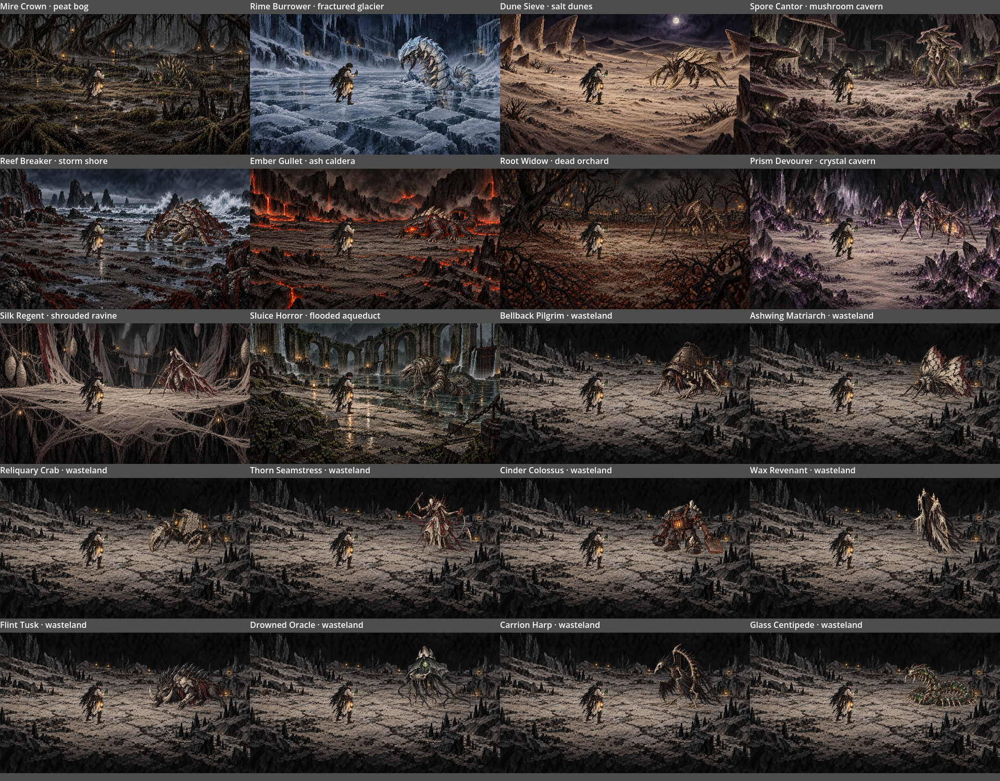

# Enemy artwork and reusable habitats

Both September 15 concept folders are now represented by independent fighter profiles and environment resources. Enemy profiles contain artwork and display settings only. Preview encounters associate an enemy with the source habitat for convenient comparison; that association does not bind the enemy to that terrain.

The ten enemy-lineup concepts reuse `wasteland/arena.png`. Spore Cantor and its mushroom cavern reuse the previously prepared assets. The other nine habitat concepts each receive a separate environment-only background.



## Preview any combination

From the repository root:

```bash
./scripts/godot.sh res://devtools/battle_art_gallery.tscn
```

Select any enemy and any environment independently. Enable **Two copies** to see independent instances of the same artwork. This is an art viewer and does not modify a saved battle. Artwork is also available directly through the Godot Inspector resources listed below.

These are usable visual assets. The new enemies still need combat definitions, decks, abilities and balance before appearing as playable opponents in the battle selector. No illustrative health/energy numbers from the mockups have been adopted as game rules.

## Source coverage

All paths below are relative to `dice-and-destiny-client/content/battle_visuals/`. Each enemy also has a matching transparent PNG at `assets/battle/fighters/<id>.png` and a preview at `encounters/<id>.tres`.

| Enemy | Visual profile | Example habitat resource |
| --- | --- | --- |
| Mire Crown | `fighters/mire_crown.tres` | `habitats/peat_bog.tres` |
| Rime Burrower | `fighters/rime_burrower.tres` | `habitats/fractured_glacier.tres` |
| Dune Sieve | `fighters/dune_sieve.tres` | `habitats/salt_dunes.tres` |
| Spore Cantor | `fighters/spore_cantor.tres` | `habitats/mushroom_cavern.tres` |
| Reef Breaker | `fighters/reef_breaker.tres` | `habitats/storm_shore.tres` |
| Ember Gullet | `fighters/ember_gullet.tres` | `habitats/ash_caldera.tres` |
| Root Widow | `fighters/root_widow.tres` | `habitats/dead_orchard.tres` |
| Prism Devourer | `fighters/prism_devourer.tres` | `habitats/crystal_cavern.tres` |
| Silk Regent | `fighters/silk_regent.tres` | `habitats/shrouded_ravine.tres` |
| Sluice Horror | `fighters/sluice_horror.tres` | `habitats/flooded_aqueduct.tres` |
| Bellback Pilgrim | `fighters/bellback_pilgrim.tres` | `habitats/wasteland.tres` |
| Ashwing Matriarch | `fighters/ashwing_matriarch.tres` | `habitats/wasteland.tres` |
| Reliquary Crab | `fighters/reliquary_crab.tres` | `habitats/wasteland.tres` |
| Thorn Seamstress | `fighters/thorn_seamstress.tres` | `habitats/wasteland.tres` |
| Cinder Colossus | `fighters/cinder_colossus.tres` | `habitats/wasteland.tres` |
| Wax Revenant | `fighters/wax_revenant.tres` | `habitats/wasteland.tres` |
| Flint Tusk | `fighters/flint_tusk.tres` | `habitats/wasteland.tres` |
| Drowned Oracle | `fighters/drowned_oracle.tres` | `habitats/wasteland.tres` |
| Carrion Harp | `fighters/carrion_harp.tres` | `habitats/wasteland.tres` |
| Glass Centipede | `fighters/glass_centipede.tres` | `habitats/wasteland.tres` |

## Asset creation and review

Mode: built-in image generation with reference-image editing. Source mockups are preserved. Cutouts are newly rendered from their source creature design and pose, with true transparent alpha; backgrounds are reconstructed without characters or interface. Fine details can differ from the flattened mockups.

The exact initial prompt set, source mapping, resource IDs and output paths are recorded in [battle-art-extraction-manifest.json](battle-art-extraction-manifest.json). Any targeted transparency corrections are recorded there as revisions. Generated source-file provenance is in [battle-art-generated-files.json](battle-art-generated-files.json). The previous Spore Cantor extraction is documented in [battle-visual-composition.md](battle-visual-composition.md).

Fighter PNGs live in `dice-and-destiny-client/assets/battle/fighters/`; new habitat PNGs live in `dice-and-destiny-client/assets/battle/habitats/`. The visual library registers all profiles and all 11 distinct environments, including the reused wasteland and mushroom cavern.

## Validation

```bash
./scripts/godot.sh --headless --script res://tests/presentation/verify_enemy_art_catalog.gd
./scripts/godot.sh --script res://tests/presentation/verify_enemy_art_catalog.gd
./scripts/godot.sh --headless --script res://tests/presentation/verify_battle_scenery.gd
```

The catalog check covers all 20 source concepts, unique IDs, resource loading, meaningful transparency and clear corners, widescreen environments, complete creature bounds, shared habitat references, gallery selection independence and repeated instances. The graphical run creates `.godot/enemy-art-catalog.png`, a labeled contact sheet of the actual game renderer's compositions, for visual review.

Validated September 19, 2026: headless and graphical catalog checks passed; the existing battle scenery integration check passed. The overview above is copied from the graphical check, not an image-generation mockup.
