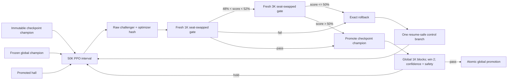
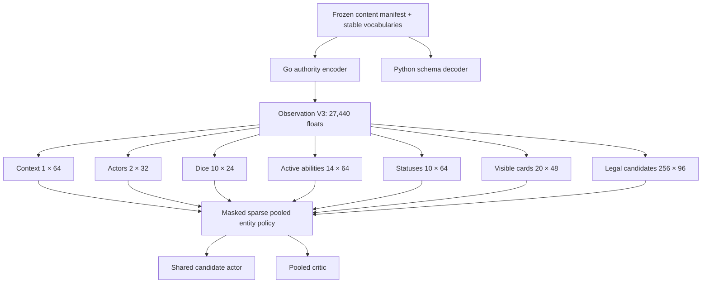

# Observation V3 champion campaign report

Date: 2026-08-04 (America/Chicago)  
Baseline: `origin/main` at `1a8aa21c7ed020a0a4482ebab734b256e6f64609`  
Campaigns: original `v3-champion-campaign-20260804-main`; replacement
`v3-champion-campaign-20260804-90m-main`  
Outcome: engineering success; gameplay promotion did not pass

## Executive result

All three requested systems were implemented and verified before the timed campaign:

1. Champion-gated, reversible, history-driven training
2. Scalable, status-aware Observation V3
3. Teacher safety with no automatic post-PPO correction

The original campaign produced Observation V3 checkpoint champion attempt 7, but stopped early
after 35m23s because its controller treated a plateau as terminal. The corrected controller was
then given an owner-authorized 90-minute replacement window. That replacement used all 5,400
seconds, exercised three automatic architecture/seed-family transitions, completed 28 PPO
intervals, and stopped only after its in-flight deadline checkpoint and final sealed comparison.

The replacement campaign's strongest checkpoint was family-1 attempt 1. Its final held-out
comparison against the required raw V3 checkpoint 400 was **349 wins, 68 draws, and 583 losses**,
or **38.30% draw-adjusted score**, over 1,000 seat-swapped games. All safety counters were zero.
This improves on the original campaign's independent 34.85% result, but did not pass the global
promotion gate. Raw checkpoint 400 therefore remains the global champion.

- Best replacement V3 checkpoint SHA-256:
  `157b9ef43eb0e94b61312e208fb9e346c7a2b5672d1178100b47db0639fa1c2d`
- Best V3 optimizer SHA-256:
  `9776646341b0949116ad5e9524da34fd938432e49a0d3059aed3fed75c35f629`
- Global raw checkpoint-400 SHA-256:
  `9cc042d0e355dceb49e98d82296c7017c9fc810296d87b151c2dc9abf8be43b8`
- Final draw-adjusted 95% Wilson interval: `[0.353373, 0.413523]` (the evaluator also records the
  raw-win interval `[0.320086, 0.379070]`)
- Final comparison seed-bank SHA-256:
  `c39276872be434f331c58dab2124277718da4b825e6e7545b992a3dfb5e38744`

The replacement's best promotion-block result was 39.25%. The three new architecture families
were locally trainable but generalized poorly to raw checkpoint 400; their best block-one scores
were 3.60%, 17.20%, and 29.95%. The independent final bank measured 38.30%. This is upward progress
over the original campaign's final result, but not close enough to trigger global block two.

## Owner-authorized 90-minute replacement campaign

### Timing and fixed inputs

- Start: `2026-08-04T23:55:43.477710+00:00`
- Deadline: `2026-08-05T01:25:43.477710+00:00`
- Finish: `2026-08-05T01:28:49.504944+00:00`
- Authoritative timer: 5,585.961 seconds; 5,400-second window plus 185.961 seconds of required
  checkpoint/final-comparison grace
- Deadline checkpoint: attempt 28 began with 16.187 seconds remaining, crossed the deadline
  during PPO, then completed its save and 1K checkpoint gate exactly once
- No attempt 29 started; `window_fully_used=true` and `stopped_after_deadline_grace=true`
- Owner-authorized battery launch was recorded as `allow_battery_power=true`; AC connected later
  and the campaign ended on AC at 99%
- Source tree SHA:
  `5d37eb59ffb422de6fda522d98ca8d41f2503f21cc9199e5198293b11b27a3cf`
- Observation manifest SHA:
  `06d90d507314ba91a86fe62279ca7b3d0faadfa82c415e50139c2a0350e67847`
- Seed-bank internal manifest SHA:
  `a03b999cc8b65178c5d4c5209e3cf87e83027e39088e067fee4101387779806c`
- Signed family-plan internal SHA:
  `3a01e0f9ce5c44de8a3afec9915837b89c3fc01d648e1fed51b63154c41522af`
- Initial checkpoint SHA:
  `ab44839b319588c5df2fbfe30c3af20699f827c46e2ead43a7dea7e1ed9c1e16`
- Frozen raw checkpoint-400 SHA:
  `9cc042d0e355dceb49e98d82296c7017c9fc810296d87b151c2dc9abf8be43b8`
- Post-PPO correction: disabled for every interval

The repaired controller's full-window behavior was proven in the real campaign. Three controlled
failures plateau a parent branch; remaining time now starts the next signed family rather than
terminating the campaign. Every new family changes exactly one architecture toggle and uses a new
seed:

| Family | Seed | Width | Depth | Activation | Change from previous | Attempts | Stop reason |
|---|---:|---:|---:|---|---|---:|---|
| 1 | 23 | 96 | 2 | tanh | continued original best | 4 | three controlled failures |
| 2 | 24 | 128 | 2 | tanh | width 96 → 128 | 11 | three controlled failures |
| 3 | 25 | 128 | 3 | tanh | depth 2 → 3 | 8 | three controlled failures |
| 4 | 26 | 128 | 3 | relu | activation tanh → relu | 5 | deadline |

### Replacement workload and safety

- 28 PPO intervals × 52,224 aligned steps = **1,462,272 attempted learner steps**
- 15,144 complete training episodes
- 2,818.448 seconds inside training intervals; aggregate 518.82 steps/second
- 49,000 checkpoint-gate games: 28 B1 blocks plus seven fresh 3K B2 blocks
- 11,000 triggered global-gate games and 1,000 final-comparison games
- **61,000 total evaluation games**, all from predeclared, distinct, seat-swapped banks
- 11 checkpoint passes, 17 checkpoint failures, and no global promotion
- Zero authority rejects, hidden/state leaks, invalid indices, replay mismatches, stale actions,
  wrong-seat actions, or unexplained truncations in every training interval and gate

### Every replacement checkpoint and control decision

W/D/L is from the challenger perspective. B2 is an independent fresh 3,000-game block.

| # | Family | Parent | Recipe/control | B1 W/D/L (score) | B2 W/D/L (score) | Decision | Global W/D/L (score) |
|---:|---|---|---|---|---|---|---|
| 1 | F1 | original attempt 7 | LR 1.5e-4, 8 ep | 547/44/409 (56.90%) | — | pass | 358/69/573 (39.25%) |
| 2 | F1 | 1 | inherited | 457/63/480 (48.85%) | 1327/202/1471 (47.60%) | fail/rollback | — |
| 3 | F1 | 1 | LR 1.5e-4 → 7.5e-5 | 471/58/471 (50.00%) | 1416/168/1416 (50.00%) | fail/rollback | — |
| 4 | F1 | 1 | epochs 8 → 4 | 454/71/475 (48.95%) | 1364/190/1446 (48.63%) | fail; family plateau | — |
| 5 | F2 | F2 base | LR 3e-4, 8 ep | 284/76/640 (32.20%) | — | fail/rollback | — |
| 6 | F2 | F2 base | LR 3e-4 → 1.5e-4 | 466/45/489 (48.85%) | 1248/174/1578 (44.50%) | fail/rollback | — |
| 7 | F2 | F2 base | epochs 8 → 4 | 580/90/330 (62.50%) | — | pass | 14/12/974 (2.00%) |
| 8 | F2 | 7 | inherited | 380/85/535 (42.25%) | — | fail/rollback | — |
| 9 | F2 | 7 | LR 3e-4 → 1.5e-4 | 342/82/576 (38.30%) | — | fail/rollback | — |
| 10 | F2 | 7 | epochs 4 → 2 | 459/110/431 (51.40%) | 1461/312/1227 (53.90%) | pass | 28/15/957 (3.55%) |
| 11 | F2 | 10 | inherited | 340/106/554 (39.30%) | — | fail/rollback | — |
| 12 | F2 | 10 | LR 3e-4 → 1.5e-4 | 456/122/422 (51.70%) | 1387/326/1287 (51.67%) | pass | 27/18/955 (3.60%) |
| 13 | F2 | 12 | inherited | 420/103/477 (47.15%) | — | fail/rollback | — |
| 14 | F2 | 12 | LR 1.5e-4 → 7.5e-5 | 385/98/517 (43.40%) | — | fail/rollback | — |
| 15 | F2 | 12 | epochs 2 → 1 | 307/111/582 (36.25%) | — | fail; family plateau | — |
| 16 | F3 | F3 base | LR 3e-4, 8 ep | 250/63/687 (28.15%) | — | fail/rollback | — |
| 17 | F3 | F3 base | LR 3e-4 → 1.5e-4 | 504/112/384 (56.00%) | — | pass | 23/14/963 (3.00%) |
| 18 | F3 | 17 | inherited | 426/128/446 (49.00%) | 1322/323/1355 (49.45%) | fail/rollback | — |
| 19 | F3 | 17 | LR 1.5e-4 → 7.5e-5 | 656/46/298 (67.90%) | — | pass | 24/13/963 (3.05%) |
| 20 | F3 | 19 | inherited | 778/34/188 (79.50%) | — | pass | 143/58/799 (17.20%) |
| 21 | F3 | 20 | inherited | 416/81/503 (45.65%) | — | fail/rollback | — |
| 22 | F3 | 20 | LR 7.5e-5 → 3.75e-5 | 424/47/529 (44.75%) | — | fail/rollback | — |
| 23 | F3 | 20 | epochs 8 → 4 | 363/57/580 (39.15%) | — | fail; family plateau | — |
| 24 | F4 | F4 base | LR 3e-4, 8 ep | 877/39/84 (89.65%) | — | pass | 43/7/950 (4.65%) |
| 25 | F4 | 24 | inherited | 824/23/153 (83.55%) | — | pass | 152/49/799 (17.65%) |
| 26 | F4 | 25 | inherited | 587/73/340 (62.35%) | — | pass | 259/76/665 (29.70%) |
| 27 | F4 | 26 | inherited | 527/67/406 (56.05%) | — | pass | 257/85/658 (29.95%) |
| 28 | F4 | 27 | inherited; deadline grace | 390/67/543 (42.35%) | — | fail/rollback; deadline | — |

Global block one failed for every challenger, so no global block two or three was authorized. The
separate final bank evaluated the best selection checkpoint, attempt 1, at **349/68/583 (38.30%)**
with adjusted 95% interval `[35.3373%, 41.3523%]`; the promotion decision was fail.

### Exact replacement checkpoint hashes

```text
attempt-001  157b9ef43eb0e94b61312e208fb9e346c7a2b5672d1178100b47db0639fa1c2d
attempt-002  58cc5a329d9c2f50bd262d32b418357257e597bce57d99d4aea9dd90270352ee
attempt-003  e080e220c08b9f468d080f777c471f69572db8de8dc4787ebd620e41a0889724
attempt-004  67f8ce839900ef512bd709b1b24896315c1d4857b1d59ae4b587e04c206cf9cc
attempt-005  fc8d111668f1ecf7ae452e73f91548adf24e49444bb9edd058be6d48a0372a4d
attempt-006  82ae9f20c979a3cc70140a80c46769a7f4bc872889a5c6faa9090d13302bb3d1
attempt-007  7bed362181572209e39a2b83cb896bce17bacea1b6d2b23a2bf54a04119f79d4
attempt-008  0b6439629967b29a1b42615625019048aff93f45b0e98ac62cf3c82c06c03d3d
attempt-009  a63366b5bfb3b929bd3f232de7da139637f65c1e4649a38c0f63e07123cd1f68
attempt-010  c7c798b8533b0dc8ffac7c24bf6ca5a0f088560edccef5cfb07632edc7367b83
attempt-011  3febf4b0069ae1ee6c06e1cb0ecbdfa269aa71a01de9c22c176594da8aa342da
attempt-012  ade4a6b7ce8a4f499b091986ab29a339042c5a5defc62d4b19f964aca9dca7e7
attempt-013  e0ea855bab95dcd72ec9a0c5ee41584e7b152ffefe50b5792134907079ebb17b
attempt-014  fd7eab2b22bf109626336d17c1c21ec047cec156bd18abc64a65f761f8b17b29
attempt-015  6aca82842df5d8f526438d9e555c8a5645eedc002bdc4884898206ee2850ebc6
attempt-016  adf8407f4bc90bb58159c11b8bac2e1bd28f95cb3f9c9367c5a2bbf0b5e78976
attempt-017  f9bc0d1c041801aff314dbd7aac67748330b64544e781ced83d669599f8f2dba
attempt-018  8028241e18d86dbf162358c2af0880243e08e354de3394a3b34d63d4d3b857e1
attempt-019  840043a095dd4434fa6e0a2e5868de030a3c83f0355cd3734a0dd4966fb41d3f
attempt-020  d62ae2de1e6469c4b4025b94ab59b8614a387f1736251d7b68d030f5c95769ac
attempt-021  27c0a0d97f437d41a13f2c343ddd8176c009522963090357df8b2e0556800a4b
attempt-022  25d4a5bc1bcabeb90a9ee40c83cd6806b767fbf0a8971a4d7cd8f5e17e862c9a
attempt-023  bf39e3f9265e9e3a25f837f198ac9b6becf3b515a26d03b34d031e90e514c8f1
attempt-024  9ea89bf21e7dbe40cebd473e71dd55d82fe1947d2a485454455ab9facef66c2a
attempt-025  0471ebe76ccba670adc59c072028a89959f558bcf920fceed827a304881a5146
attempt-026  41baf12c70a9b6f9d79ee0ce78d818f48be26db64101885551eb7906e52a0339
attempt-027  fd86a8ff96221952a769bcb99cadb893fe249616dd83944bfe22a033419a4273
attempt-028  9afe83b96d34cabe735be33e197fd2d9460090413519e48091539fda6c91a162
```

### Replacement evidence and parity

The 61-record append-only history verifies as a complete hash chain ending at
`5be83f0a0b01c5f71e27374df136eda4ec5d551fa976041905732223c2286496`.
The best raw checkpoint was exported only as a preserved evidence model; it was not installed as
global or deployed over an existing model. Export SHA
`74914e00bc444ff7779533633c63afb50e46d3114bb0a48108818e978bc1c509` passed Python/Go
parity across 155 actions and the terminal seat-B winner.

Replacement artifact byte hashes:

```text
campaign-state.json                 87d66fc38e33562ec343e1c135a3e6bfe5f29a2f8acffd87fc08674050ea0423
champion-registry.json              f783bad429ab86fba2b03c1f9bae8b477320c5bb13c06f355ab0709ab3731f16
history/experiments.jsonl           388d9c3610addd2e5bf160d6c50f977af38e33ea759488d8cfa7db8aaf4d0d99
history/experiments.md              0c0704da91179fda5242bca13bbd04f10b7178ddeb9bcb1bedcbd7ce1096e548
preflight/campaign-preflight.json   360b4e41e6697cc92671d6f867f819fec2795ba8984679353599d81d07e836c1
final-comparison/summary.json       f039889e41542fcac01f413e2d00bfda8314a60c05dfe1f870c9e6afaa7f3f83
```

## Implementation

### Champion control, rollback, and history

`champions.py` defines immutable checkpoint/global champion records, exact checkpoint hashes,
atomic registry writes, the adaptive 1,000/3,000-game gate, global best-of-three promotion logic,
Wilson confidence/non-inferiority checks, disjoint hashed seed banks, a monotonic campaign timer,
and an append-only hash-chained ledger. `campaign.py` supplies preflight, interval training,
promotion, exact model-plus-optimizer rollback, patience, deadline grace, telemetry, and the final
global comparison.

The opponent pool is registry-driven and category-weighted rather than directory-driven:
checkpoint champion 50%, global champion 40%, promoted hall 10%. Identical paths are deduplicated.
Ordinary saved checkpoints never enter the pool.



Every interval records PPO KL, entropy, clipping, policy/value loss, explained variance, gradient
norm, parameter movement, action/ability/card/reroll behavior, seat/opponent distribution,
throughput, and all safety counters. The ignored human rendering is `history/experiments.md`; the
original machine ledger contains 24 verified records and ends at record hash
`27c667a441cf9f1199fd2366c47b9923c3c63fafabb79c1f7523874e464c2e13`. The replacement ledger
contains 61 verified records and ends at
`5be83f0a0b01c5f71e27374df136eda4ec5d551fa976041905732223c2286496`.

### Observation V3 and V3 policy

The frozen content-derived manifest has content SHA
`33d540af82133e8b8ad7e633c4cca6e352367da9d72f0dd930bc22ebcd263fd0` and manifest SHA
`06d90d507314ba91a86fe62279ca7b3d0faadfa82c415e50139c2a0350e67847`. It supports the eligible
`blade_warden` and `venom_goblin` roster without hard-coded mechanics equivalence. The final vector
has 27,440 float values and a 256-action legal-candidate capacity.



The manifest explicitly audits capacities: five dice, seven active abilities, five statuses per
actor, the complete 20-card visible-hand capacity, five tiers per ability, two requirements per
tier, and 256 legal candidates. Overflow fails before training. Status identity/stacks, active
forms/abilities, health, visible cards, dice, targets, tokens, command/operation identity, masks,
and private/public state boundaries are versioned. Current content contains no form vocabulary,
but form slots and active-form semantics are part of the schema and encoder contract.

Python and Go have separate V3 encoders tied to the same manifest, while V1/V2 loading is retained.
V3 models use sparse valid-row entity/candidate computation rather than applying dense networks to
all padded rows. V3 export embeds source checkpoint/parameter, manifest, content, schema, source,
and training-engine hashes.

### Teacher safety

The campaign has no post-PPO correction path. A V3 mechanics teacher is permitted only as a
declared initial warm-start; raw PPO children are saved, evaluated, promoted, or rolled back
without teacher rewriting. Teacher agreement is diagnostic and cannot promote a model. Tests guard
the default and reject a configured post-PPO correction request.

The full-game warm-start ablation selected the mechanics warm-start:

| Variant versus random | W | D | L | Adjusted score |
|---|---:|---:|---:|---:|
| No warm-start | 0 | 0 | 200 | 0.00% |
| Mechanics, 2,000 decisions, 5 epochs | 199 | 0 | 1 | 99.50% |

Selected warm checkpoint SHA:
`0f97111e236bb793bb03b0db625b0b7e291730b81b5783c30e160d0dfac4b2f3`; optimizer SHA:
`479a6da7c15107c9c0ec5b8c90cc02457cf02c9108f1c7f559e19d5639a14c28`.
Its separate 1,000-game development anchor against the global champion was 12/6/982 (1.50%).

## Compatibility and migration

- Observation/action/environment V3 identifiers are distinct; V2 weights are never reinterpreted
  as V3.
- V1 and V2 checkpoints remain independently loadable as training/evaluation opponents.
- Go deployment selects the correct policy reader by export format; existing accepted exports are
  untouched.
- Combatant definitions are explicit in reset/evaluation configuration, enabling arbitrary
  manifest-eligible seat definitions.
- Snapshot and full/encoded/parity transports carry the V3 fields without weakening authority.
- `pyyaml` is locked because the content-derived manifest builder reads roster YAML.

## Preflight and acceptance evidence

| Gate | Result | Evidence |
|---|---|---|
| A · Champion control | PASS | Exact boundary/tie tests, 1K/3K and global-series unit tests, atomic registry, optimizer-exact rollback |
| B · History | PASS | Original 24-record and replacement 61-record append-only hash chains; machine JSONL and human Markdown rendering; query tests |
| C · Pool integrity | PASS | Explicit champion registry and weighted/deduplicated sampling tests; ordinary file has no effect |
| D · Observation completeness | PASS | Frozen manifest capacity audit; status/form/ability/card/dice/health tests; overflow is fatal |
| E · Privacy/parity | PASS | Fixed/adversarial tests plus 500 generated games; maximum 87 candidates; final-manifest 10-game parity; safety zero |
| F · Model compatibility | PASS | V1/V2 opponents retained; V3 version separation; hashed V3 export and Go replay parity |
| G · Teacher safety | PASS | No automatic post-PPO correction; raw checkpoints only; guard tests |
| H · Learning telemetry | PASS | Required PPO, behavior, distribution, movement, throughput, and safety fields recorded per interval |
| I · Campaign timer | PASS | Original premature stop preserved; repaired 5,400-second replacement used the full window, finished attempt 28 under grace, and started no attempt 29 |
| J · Authority safety | PASS | All preflight, campaign, final, and export replay safety fields zero |
| K · Outcome evidence | PASS (global held) | Original final 322/53/625 (34.85%); replacement final 349/68/583 (38.30%); hashes and seat swaps preserved |

Additional preflight evidence:

- Raw checkpoint 400 was verified at its required path and exact SHA before use.
- Observation capacity/parity ran 500 generated/adversarial games with zero leaks, mismatches,
  invalid actions, authority rejects, stale/wrong-seat submissions, or truncations.
- Tiny V3 learning changed parameters over 3,072 steps at about 631 steps/second.
- Champion-pool selection, timer boundaries, adaptive tie behavior, ledger completeness, and exact
  optimizer rollback passed focused probes.
- V3 preflight export SHA
  `97025c0bfa61fd1eed59e1ba94411554acb43ed9c6d17a69f730a70fd2905888`
  reproduced 124 Python actions and the winner in Go.
- Before campaign start: AC power, approximately 277 GB free disk, healthy memory pressure, and
  the `max` CPU profile resolved to 12 rollout workers with worker threads 1/1/1 and learner
  threads 4/1/4.
- The replacement launch recorded an explicit owner-authorized battery override; AC connected
  during the run and host state ended healthy on AC.

## Timed campaign

### Timing and fixed configuration

- Authoritative start: `2026-08-04T22:14:30.599396+00:00` (17:14:30.599 Chicago)
- Deadline: `2026-08-05T01:14:30.599396+00:00` (20:14:30.599 Chicago)
- Finish: `2026-08-04T22:49:53.623190+00:00` (17:49:53.623 Chicago)
- Elapsed: 2,123.056 seconds (35m23.056s)
- Remaining: 8,676.944 seconds (2h24m36.944s)
- Stop reason: three controlled failures from checkpoint champion attempt 7; branch plateau
- Deadline overrun/grace: none; `deadline_grace` is empty
- Seed: 22
- Frozen campaign source tree SHA:
  `d5abe35eab8082a6728cf082eebfae15161629b9e2f2118f23b117b1d0c3f389`
- Seed-bank internal manifest SHA:
  `5f939189fca408a8721acb23d92fa970d95b036379f427e6ff6d67cd6cd4cab3`
- Promotion rule: deterministic policies, real authority, distinct fresh seeds, every seed played
  in both seats; block 1 pass at >=52%, fail at <=48%, otherwise fresh 3K requiring >50%.
- Global rule: 1K blocks, win two blocks, pooled score >50%, 2% non-inferiority confidence rule,
  and zero safety counters.
- PPO: rollout 256/worker, batch 256, epochs 8, LR 3e-4 initially, gamma .995, GAE .95,
  entropy .01, clip .2, win/loss/draw reward +1/-1/0, no shaping, no correction.

One launch at `2026-08-04T22:12:37.894968+00:00` aborted before the training loop because the new
V3 policy lacked the instrumentation interface expected by the profiler. It consumed zero learner
steps, games, or promotion seeds. The abort is permanently recorded as
`campaign_start_aborted_preloop`, its timer was voided, and the regression was fixed and tested
before the authoritative campaign start above.

### Work performed

- 10 PPO intervals attempted, each 52,224 actual steps at a full rollout boundary
- 522,240 total attempted learner steps; 261,120 steps on the final accepted path
- 5,958 training episodes
- 891.861 seconds in training intervals; 585.56 aggregate steps/second
- 25,000 checkpoint-gate games, 5,000 triggered global-gate games, and 1,000 final games
- 31,000 total timed-campaign evaluation games, all using predeclared held-out banks
- Post-campaign host state: 90% memory free, no thermal/performance warning, 1.09 GB swap free

### Checkpoint gates and control progression

W/D/L is always from the challenger perspective. “B2” is a fresh 3,000-game block, not a
continuation of B1 seeds.

| Attempt | Parent | Recipe/control | Steps | B1 W/D/L (score) | B2 W/D/L (score) | Decision | Global block W/D/L (score) |
|---:|---|---|---:|---|---|---|---|
| 1 | warm base | LR 3e-4, 8 ep | 52,224 | 592/110/298 (64.70%) | — | promote checkpoint | 12/4/984 (1.40%), hold |
| 2 | 1 | inherited | 104,448 | 904/27/69 (91.75%) | — | promote checkpoint | 210/68/722 (24.40%), hold |
| 3 | 2 | inherited | 156,672 | 447/55/498 (47.45%) | — | reject, rollback | — |
| 4 | 2 | LR 3e-4 → 1.5e-4 | 156,672 | 559/42/399 (58.00%) | — | promote checkpoint | 277/61/662 (30.75%), hold |
| 5 | 4 | inherited | 208,896 | 544/50/406 (56.90%) | — | promote checkpoint | 300/69/631 (33.45%), hold |
| 6 | 5 | inherited | 261,120 | 466/55/479 (49.35%) | 1343/181/1476 (47.783%) | reject, rollback | — |
| 7 | 5 | fresh sibling seeds | 261,120 | 474/52/474 (50.00%) | 1426/149/1425 (50.0167%) | promote checkpoint | 300/71/629 (33.55%), hold |
| 8 | 7 | inherited | 313,344 | 476/48/476 (50.00%) | 1395/210/1395 (50.00%) | reject, rollback | — |
| 9 | 7 | fresh sibling seeds | 313,344 | 473/73/454 (50.95%) | 1386/217/1397 (49.8167%) | reject, rollback | — |
| 10 | 7 | epochs 8 → 4 | 313,344 | 479/42/479 (50.00%) | 1403/194/1403 (50.00%) | reject, rollback; plateau | — |

Combined 4,000-game reports for expanded attempts:

| Attempt | Combined W/D/L | Adjusted score |
|---:|---:|---:|
| 6 | 1809/236/1955 | 48.175% |
| 7 | 1900/201/1899 | 50.0125% |
| 8 | 1871/258/1871 | 50.000% |
| 9 | 1859/290/1851 | 50.100% (B2 still failed by its required independent rule) |
| 10 | 1882/236/1882 | 50.000% |

All checkpoint/global promotion attempts stopped after global block one because none exceeded 50%;
no global block two or three was warranted.

### Exact raw checkpoint hashes

```text
attempt-001  50fdd766cbb7ae80156938f802dc36653ef36e89829dc4ed566b2a77f60e07b9
attempt-002  230c614d2956943ba414407f8fd39b10e197739fbdd57f605e70d041d05eb83d
attempt-003  61faa82eac836f97d96a0440fc09eaca7b379587d9b07ab379c588cb612966e3
attempt-004  6f754c1a37bc8c159fa5b9b2fc22e9fff119ea412a818da865e4d6332beb242b
attempt-005  09b2c9eadd0556d38c59c0ab6717e92900d3a2cd2f686853c083f1d46c84e120
attempt-006  6c94b520592c51990ac2e70997f8606b197af03cb1125aba27018ff1874ef3b6
attempt-007  ab44839b319588c5df2fbfe30c3af20699f827c46e2ead43a7dea7e1ed9c1e16
attempt-008  b2c48905ccdbca88e5351b39b1f1a595adeec6d6bc68f721ad08a87d178c2227
attempt-009  63befcd29f9e21d5d2acc94b5b4bae4c891487d03edf8275ab2e2c2e1f947802
attempt-010  834dd16508808d373dc96ca3a52098f671fde01c54ff669e6d5f6f2a7610f06f
```

### Controller audit note

The ledger correctly preserves that attempts 7 and 9 were fresh-seed sibling retries with the
same recipe as their immutable parents. The pre-campaign controller chose the first conservative
failure branch as an absolute LR of 1.5e-4; when a promoted parent already used that value, the
recipe diff was empty. This did not change any checkpoint/global gate, rollback, seed, timer, or
result. After the campaign, the controller was hardened to derive the first failure LR as half of
the immutable parent's LR, with regression tests proving 3e-4 → 1.5e-4 and 1.5e-4 → 7.5e-5. The
historical ledger was not rewritten.

## Final export and runtime parity

The checkpoint champion was preserved and exported even though it was not installed as the global
game model:

- Export model ID: `v3-champion-campaign-20260804-attempt-007`
- Export SHA: `975ee3bb845bde3ff7b241ea6c046d69ff069a73836b97eb76849be922767c09`
- Source parameter SHA: `8e8b3e679eaed8a88d716802e2157f08dc37ecb546022475d46bef63f627939c`
- Python/Go replay: exact match across 281 actions and terminal draw
- Replay SHA: `a3cd65821e07d97fd428182acb566e963a47d6a08dd0d78bc2af1670d9e5fb53`

Existing V1, V2, and corrected V3 exports were not overwritten. Because global promotion failed,
the exported attempt 7 policy is an evidence artifact, not the deployed global selection.

## Final verification

All commands completed after the campaign and controller hardening:

```text
uv run ruff check .                         PASS
uv run ruff format --check .                PASS (40 files formatted)
uv run pytest -q                            PASS (58 tests)
go test ./...                               PASS
go vet ./...                                PASS
go test -race ./internal/battle/...         PASS
dice-and-destiny-server/scripts/build_native.sh  PASS
./scripts/godot.sh --headless --script \
  res://scripts/verify_battle_authority.gd  PASS
./scripts/godot.sh --headless --script \
  res://tests/phase3/verify_learned_battle_v2.gd PASS (V1/V2/V3)
go run ./cmd/verify-learned-v3 ...          PASS (281 actions + terminal result)
```

## Artifacts and reproducibility

Raw evidence is intentionally ignored and preserved under
`dice-and-destiny-server/ml/runs/v3-champion-campaign-20260804/`:

- `campaign-state.json` — byte SHA
  `eae20acb8c4772b87d6dfa314697a8e13bf351831d5315dd5caaf8d9c6d3571b`
- `champion-registry.json` — byte SHA
  `43191f6213e87a09d17d22fb7315f4559a85a9c3474d5ef8e4271b094fcea8ae`
- `history/experiments.jsonl` — byte SHA
  `6a6667fc08d6ad720a2498756e35b708540ffb5b709d8a9a94cdc50892c86ea7`
- `seed-banks/manifest.json` — byte SHA
  `8ca2c82f28a408c7c7b1270667519d3198814654885b861b74e1f671822e226a`
- `final-comparison/summary.json` — byte SHA
  `8c740c8cc511f53015aaacfc422d00420c5c0d0728cf301fba12492857d07111`
- `observation-manifest-v3.json`
- `preflight/`, `attempts/attempt-001` through `attempt-010`, and all immutable raw checkpoints
- `exports/checkpoint-champion-attempt-007-v3.json` and its Python self-play replay

The seed-bank root contains 128 predeclared attempt families plus separate development and final
banks. Promotion seed banks are disjoint and were generated before their results were observed.

## Files changed

Primary new files:

- `dice-and-destiny-server/ml/dice_destiny_ml/champions.py`
- `dice-and-destiny-server/ml/dice_destiny_ml/campaign.py`
- `dice-and-destiny-server/ml/dice_destiny_ml/manifest_v3.py`
- `dice-and-destiny-server/ml/dice_destiny_ml/schema_v3.py`
- `dice-and-destiny-server/internal/battle/mlsim/manifest_v3.go`
- `dice-and-destiny-server/internal/battle/mlsim/encoding_v3.go`
- `dice-and-destiny-server/internal/battle/learned/policy_v3.go`
- `dice-and-destiny-server/cmd/verify-learned-v3/main.go`
- `dice-and-destiny-server/ml/tests/test_champions.py`
- `dice-and-destiny-server/ml/tests/test_manifest_v3.py`
- `dice-and-destiny-server/ml/tests/test_schema_v3.py`
- `dice-and-destiny-server/ml/tests/test_model_v3.py`
- `dice-and-destiny-server/ml/tests/test_teacher_safety.py`
- this report

Integration changes:

- Go simulation/runtime: `cmd/battle-ml-sim/main.go`, `internal/battle/mlsim/encoding.go`,
  `internal/battle/mlsim/environment.go`, `internal/battle/learned/session.go`, and
  `internal/battle/snapshot/snapshot.go`.
- Python CLI/runtime: `cli.py`, `bridge.py`, `evaluation.py`, `gym_env.py`, `model.py`,
  `opponent_pool.py`, `policies.py`, `profiled_ppo.py`, `training.py`, `imitation.py`, and
  `export_policy.py`.
- Supporting analysis/resources and version compatibility: `ablation.py`, `diagnostics.py`,
  `profiling.py`, `resources.py`, `schema_v2.py`, `tactical_corpus.py`, tests, `pyproject.toml`, and
  `uv.lock`.

## Recommended next single experiment

Start a new, separately ledgered campaign from immutable replacement attempt 1 and change only
champion-pool weights from checkpoint/global/hall `0.5/0.4/0.1` to `0.3/0.6/0.1`. The updated
evidence is specific: the width-96/depth-2/tanh continuation reached 39.25% on its promotion bank
and 38.30% on the independent final bank, while width 128, depth 3, and ReLU new-family toggles
peaked at only 3.60%, 17.20%, and 29.95% against the global model. More frozen-global experience
directly targets the observed objective gap without changing the best architecture, schema,
reward, teacher setup, or evaluation rules. Preserve the relative-LR rollback hardening, raw
checkpoint 400, fresh seed-bank discipline, and identical checkpoint/global gates.
