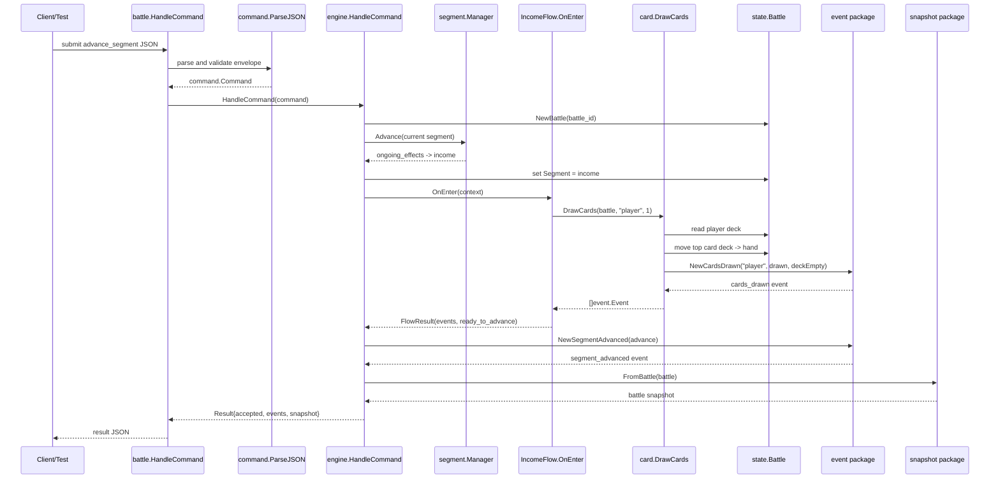

# Story 11: Income Flow Card-Draw Hook Sequence

This diagram shows the call sequence for entering the `income` segment and drawing cards through the engine flow layer.

```mermaid
sequenceDiagram
    participant Client as Client/Test
    participant Authority as battle.HandleCommand
    participant Command as command.ParseJSON
    participant Engine as engine.HandleCommand
    participant Segment as segment.Manager
    participant Income as IncomeFlow.OnEnter
    participant Card as card.DrawCards
    participant State as state.Battle
    participant Event as event package
    participant Snapshot as snapshot package

    Client->>Authority: submit advance_segment JSON
    Authority->>Command: parse and validate envelope
    Command-->>Authority: command.Command

    Authority->>Engine: HandleCommand(command)

    Engine->>State: NewBattle(battle_id)
    Engine->>Segment: Advance(current segment)
    Segment-->>Engine: ongoing_effects -> income

    Engine->>State: set Segment = income
    Engine->>Income: OnEnter(context)

    Income->>Card: DrawCards(battle, "player", 1)
    Card->>State: read player deck
    Card->>State: move top card deck -> hand
    Card->>Event: NewCardsDrawn("player", drawn, deckEmpty)
    Event-->>Card: cards_drawn event
    Card-->>Income: []event.Event

    Income-->>Engine: FlowResult(events, ready_to_advance)

    Engine->>Event: NewSegmentAdvanced(advance)
    Event-->>Engine: segment_advanced event

    Engine->>Snapshot: FromBattle(battle)
    Snapshot-->>Engine: battle snapshot

    Engine-->>Authority: Result{accepted, events, snapshot}
    Authority-->>Client: result JSON
```
