# Story 11C: Deterministic Deck Shuffle Sequence

This diagram shows the call sequence for applying an optional deterministic deck shuffle during battle setup, then drawing from the shuffled deck order when entering the `income` segment.

```mermaid
sequenceDiagram
    participant Test as Test/Setup caller
    participant Setup as setup.BattleSetupFromRunPlayer
    participant Card as card.ShuffleDeck
    participant State as state.NewBattleFromSetup
    participant Engine as engine.AdvanceSegment
    participant Income as IncomeFlow.OnEnter
    participant Draw as card.DrawCards

    Test->>Setup: convert run player state with WithDeckShuffleSource(source)
    Setup->>Setup: validate actor ID and deck
    Setup->>Setup: copy run player card zones

    Setup->>Card: ShuffleDeck(deck, source)
    Card->>Card: request bounded indexes from source
    Card->>Card: swap cards in place
    Card-->>Setup: shuffled deck order

    Setup-->>Test: state.BattleSetup with shuffled actor deck

    Test->>State: NewBattleFromSetup("battle-1", setup)
    State-->>Test: Battle with actor card zones

    Test->>Engine: AdvanceSegment(&battle)
    Engine->>Income: OnEnter(context)
    Income->>Draw: DrawCards(battle, "player", 1)
    Draw->>Draw: read current deck front/top
    Draw->>Draw: move drawn card deck -> hand
    Draw-->>Income: cards_drawn event
    Income-->>Engine: FlowResult(events, ready_to_advance)
    Engine-->>Test: battle state reflects shuffled draw order
```

