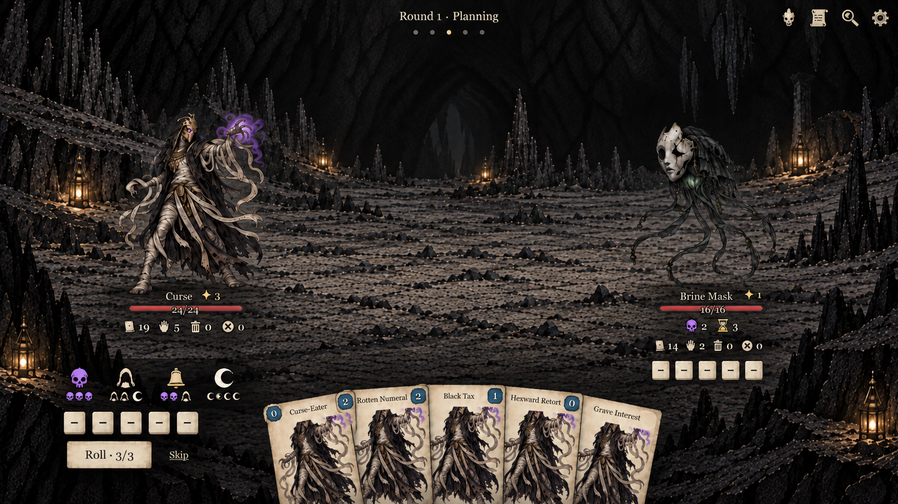
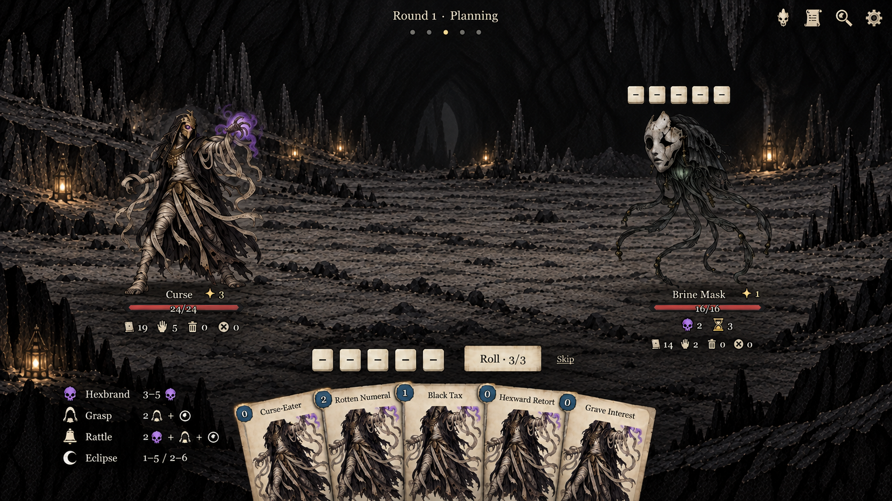
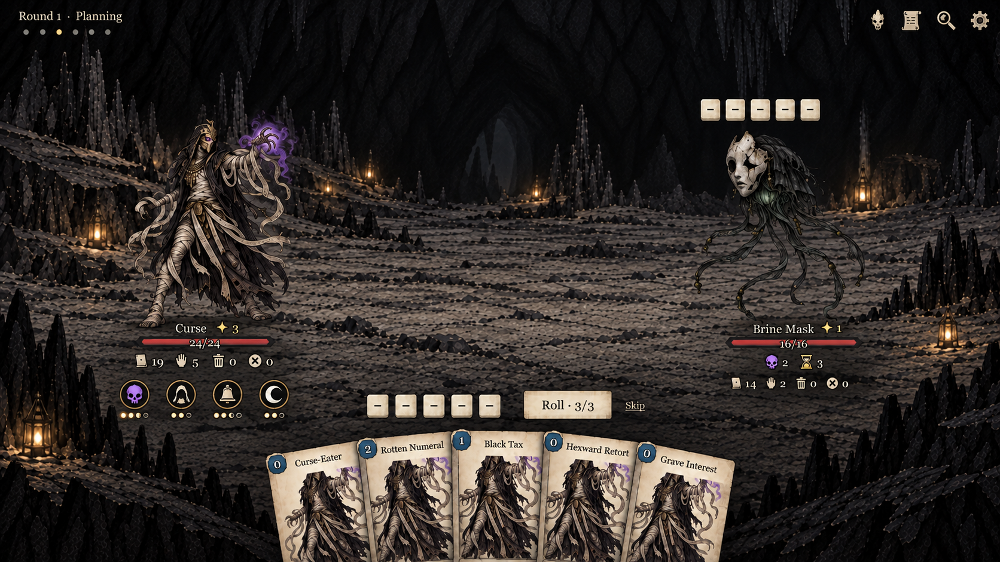
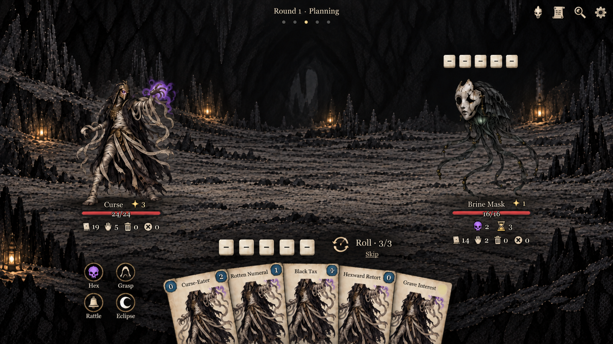
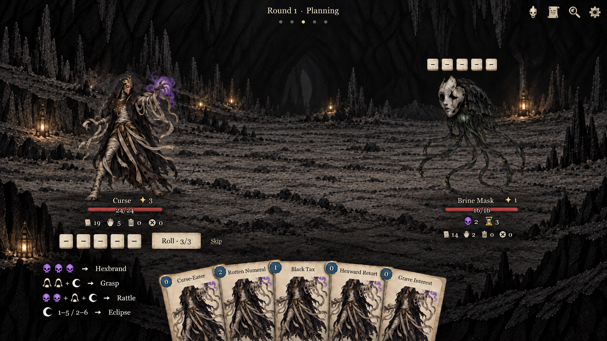
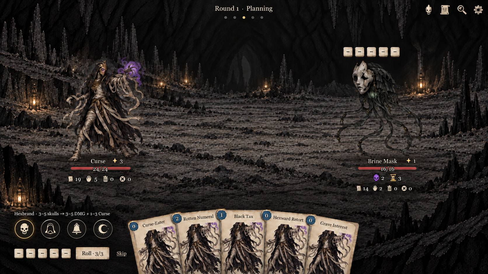
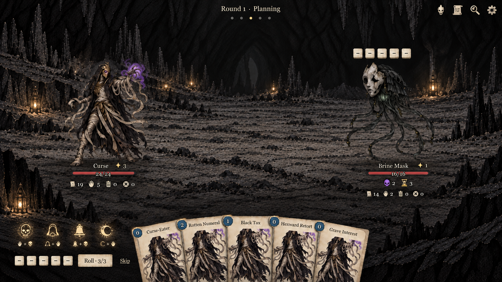
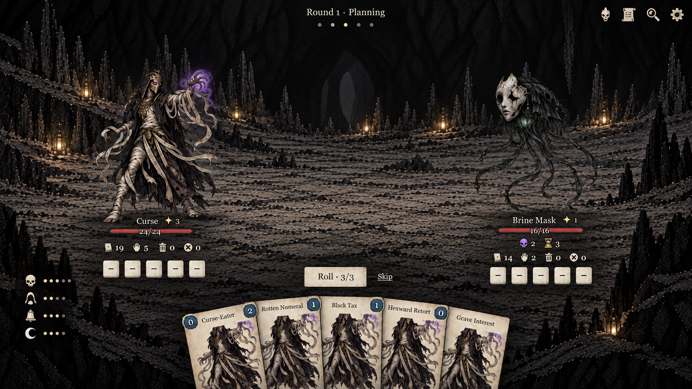
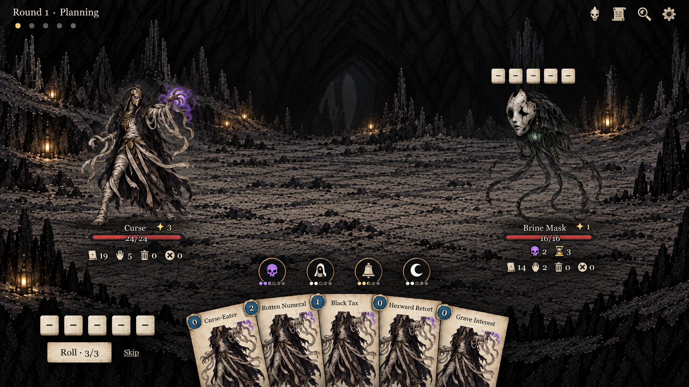
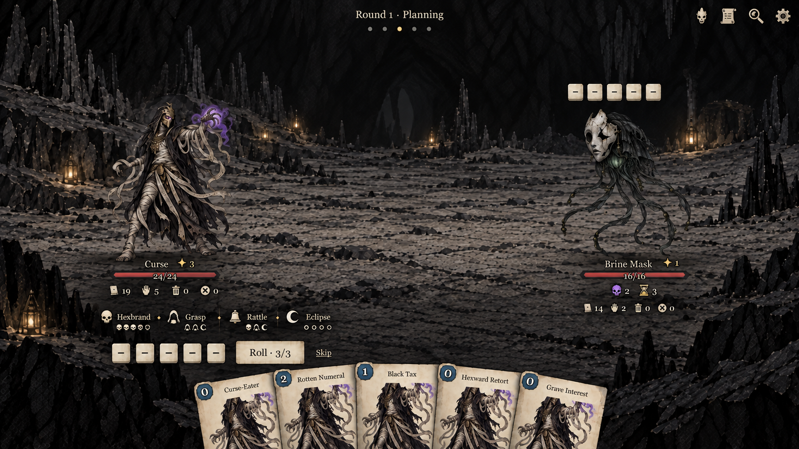

# Ten more minimal UI concepts

Created with built-in image_gen on 2026-09-28. These are design images, not implementation changes.

The approved elements are retained as design anchors: a spread five-card fan with upper-left costs followed by names, and compact health/status/pile-count information at each character. Changes focus on offensive ability presentation, player dice and Roll/Skip grouping, enemy dice placement, and a quiet phase display.

## 11. Four-rune strip

Borderless glyph strip near the player dice; enemy dice below its HUD.

## 12. Four-line ability list

Four small rows keep ability names and combo requirements visible, with player dice above the hand.

## 13. Ability crescent

Small medallions near the player HUD; phase display moved to upper left. The generated crescent is nearly straight.

## 14. Four-seal cluster

Two-by-two ability medallions with short labels; compact roll-arrow treatment above hand.

## 15. Dice-recipe shorthand

Recipe-first shorthand makes the dice combination the first thing to scan.

## 16. One-line ability inspection

Four small icons plus a single line of focused ability detail; other abilities remain visible.

## 17. Floor sigils

Warm glowing floor sigils reduce the appearance of conventional buttons.

## 18. Edge shortcuts

Narrow left-edge ability column; both dice banks sit beneath their owners.

## 19. Ability tabs above the hand

Ability medallions placed directly above the hand; dice remain lower left.

## 20. Named inline actions

Inline ability names and requirements without tile backgrounds.

## Assessment

12 and 20 retain the best discoverability because names remain visible. 11 and 18 use less space, but require players to learn glyphs. 16 offers a useful focus behavior that could be added to any arrangement. 17 is atmospheric but needs careful contrast/hit-target validation. 19 brings abilities closer to cards but needs clear visual distinction between the two action types.

Full card and ability rules remain available on hover, click/tap or controller focus; compact form does not remove the underlying information. Critical changed die state should always have visible markers, even in small dice banks. Current phase should have an accessible text label when implemented. Invisible hit regions should be larger than tiny glyph artwork.

These are layout studies. Some generated cost numerals and recipe motifs are imperfect and are not authoritative game data. The enemy status counts are illustrative. Maintain exact existing rule data in implementation. Both dice banks and all five cards remain visible in the selected images. No game code was edited or run.

Prompts are in prompts.md; refinement prompts are in correction-prompts.md.

