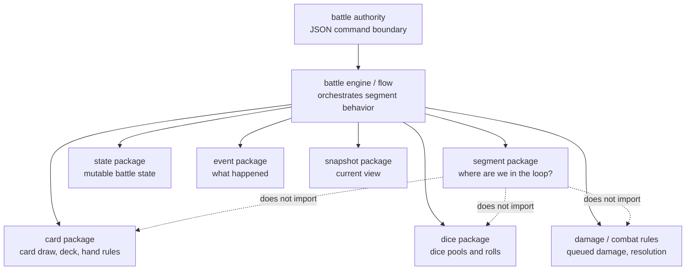
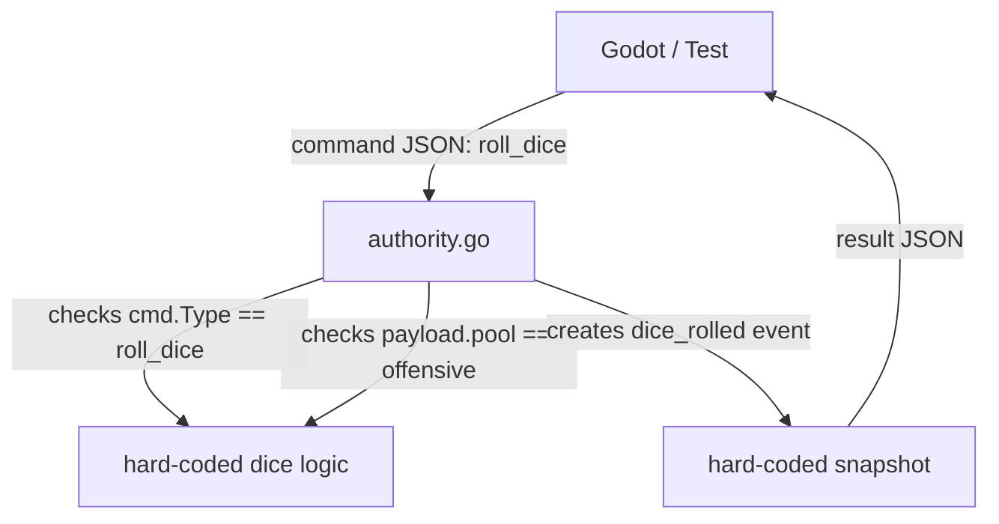
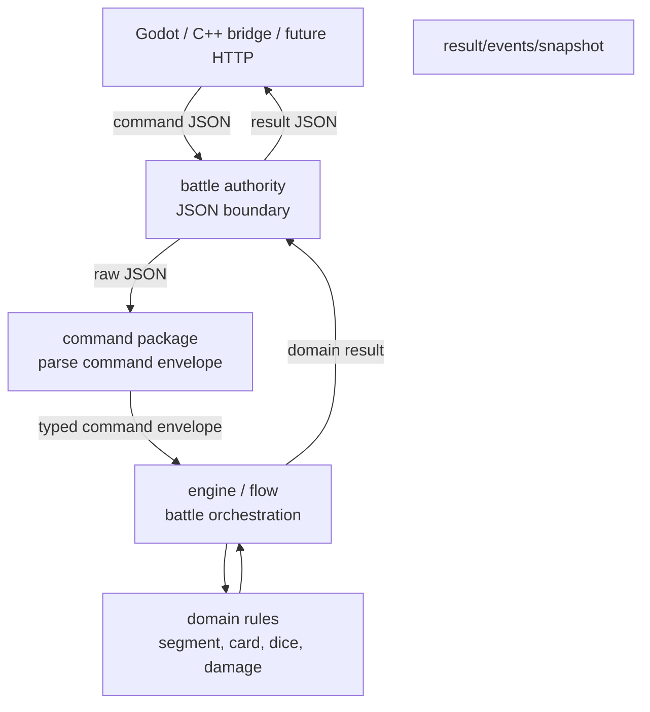
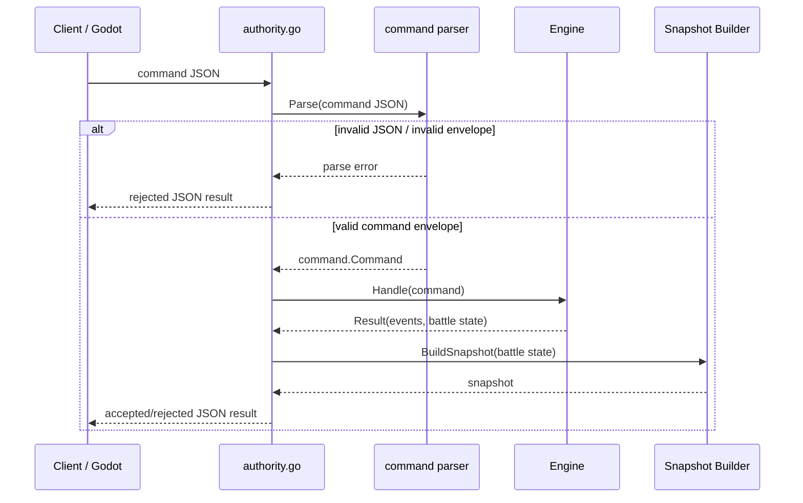
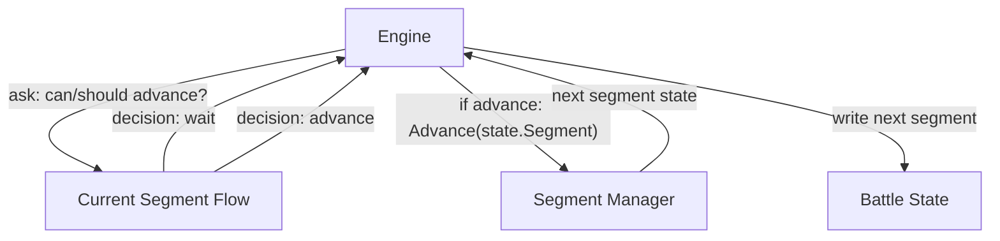
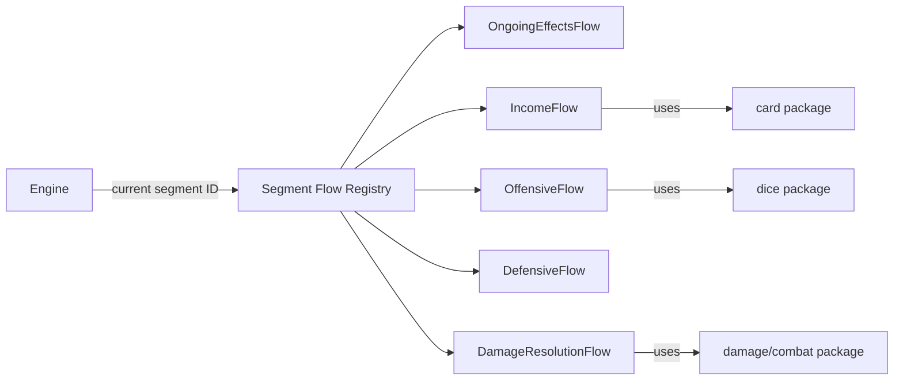
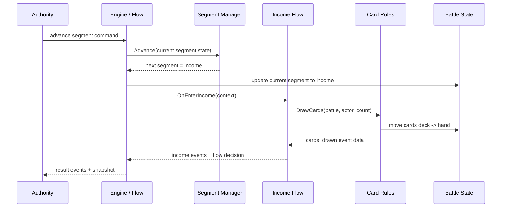
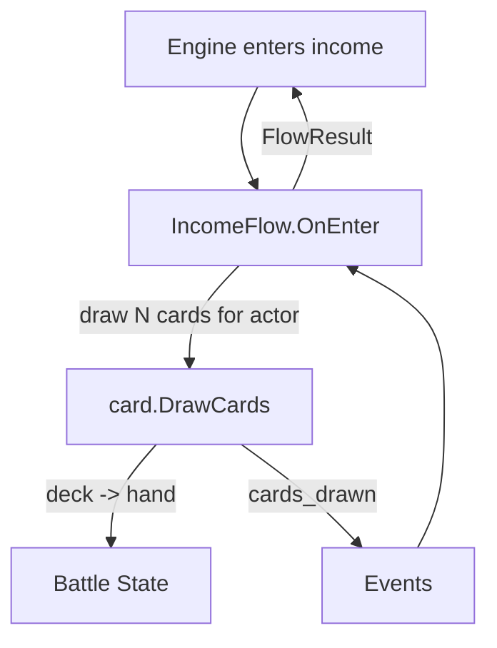
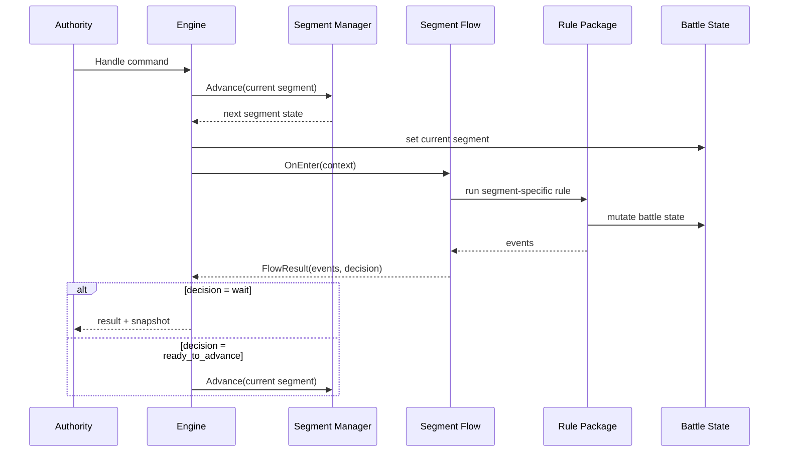

# Battle Engine Segment Flow Design

## Purpose

This document captures the design direction for growing the deterministic segment manager into the real battle engine loop.

The current segment manager is intentionally narrow:

```text
current segment
round
legal next segment
wrap behavior
```

That is not enough by itself for gameplay. Each segment needs hooks for work such as card draw, dice rolling, defense choices, ongoing effects, and damage resolution.

The design goal is to add those hooks without turning `segment` or `authority.go` into large gameplay rules files.

## Core Decision

Keep segment IDs as stable data.

Add segment flow objects as behavior.

Use an engine/flow layer to connect the current segment to the correct behavior.

```text
Segment IDs are data.
Segment flows are behavior.
Engine connects data to behavior.
Rule packages implement mechanics.
```

The segment package should answer:

```text
Where are we in the battle loop?
What segment comes next?
When does the round increment?
```

The segment package should not answer:

```text
How many cards are drawn during income?
How dice are rolled during offensive?
How damage is applied during damage_resolution?
How enemy decisions are made?
Which UI should be shown?
```

## Responsibility Map



The important dependency direction is:

```text
authority -> engine -> segment/card/dice/damage/state/event/snapshot
```

Do not make this dependency direction:

```text
segment -> card/dice/damage
```

## Authority Boundary

The current `authority.go` spike contains hard-coded `roll_dice` behavior. That was useful to prove the Godot/C++/Go loop, but it is not the target architecture.

The authority boundary should mostly:

```text
receive command JSON
decode transport-level command envelope
pass command into engine/flow
receive engine result
encode result JSON
return it
```

It may reject malformed JSON. It should not own gameplay command behavior.

It should not know:

```text
roll_dice is only allowed in offensive
offensive dice pool exists
income draws cards
damage_resolution applies queued damage
unsupported gameplay commands
```

Those are engine/domain concerns.

### Current Spike Shape



### Target Authority Shape



### Target Authority Sequence



## Segment Flow Layer

The segment manager advances only when the engine asks it to advance.

Segment flow controls whether its segment work is complete, blocked, waiting for a command, or ready to continue. The segment manager does not care why a segment is complete.

```text
IncomeFlow decides: income is complete.
Engine does: move to next segment.
SegmentManager calculates: income -> offensive.
```

This keeps segment state changes centralized while allowing each segment to own its own flow decisions.

### Flow Decision Diagram



## Hook Registry

The engine should have a registry that maps stable segment IDs to behavior.



Possible registry shape:

```go
map[segment.Segment]SegmentFlow{
	segment.OngoingEffects:   OngoingEffectsFlow{},
	segment.Income:           IncomeFlow{},
	segment.Offensive:        OffensiveFlow{},
	segment.Defensive:        DefensiveFlow{},
	segment.DamageResolution: DamageResolutionFlow{},
}
```

## Segment Flow Interface

The exact implementation can evolve, but the engine needs a shape similar to this:

```go
type SegmentFlow interface {
	ID() segment.Segment
	OnEnter(ctx *Context) (FlowResult, error)
	CanAdvance(ctx *Context) (FlowDecision, error)
	OnExit(ctx *Context) (FlowResult, error)
}
```

Possible result and decision shapes:

```go
type FlowDecision string

const (
	WaitForCommand FlowDecision = "wait_for_command"
	ReadyToAdvance FlowDecision = "ready_to_advance"
)

type FlowResult struct {
	Events   []event.Event
	Decision FlowDecision
}
```

The names are not final. The important rule is that a segment flow returns a decision to the engine instead of directly mutating the segment to the next segment.

## Income Card Draw Example

Income card draw should be connected to income through `IncomeFlow`, but the card movement rules should live in the card package.

```text
Engine enters income.
IncomeFlow runs income behavior.
IncomeFlow calls card.DrawCards.
Card rules move cards from deck to hand.
Events describe what happened.
IncomeFlow returns a flow decision.
Engine decides whether to stop or advance again.
```

### Income Sequence



### Income Hook Detail



This means `IncomeFlow` owns when card draw happens in the loop, while `card.DrawCards` owns how card draw works.

## Generic Segment Entry Sequence



## Package Direction

Near-term package direction:

```text
internal/battle/authority.go
  JSON boundary only

internal/battle/command/
  command envelope parsing
  command type constants
  payload decoding helpers

internal/battle/engine/
  battle command orchestration
  segment flow registry
  segment flow lifecycle calls
  calls into segment/card/dice/damage/state/event/snapshot

internal/battle/segment/
  segment IDs
  segment order
  segment validation
  round advancement

internal/battle/state/
  authoritative battle state
  actors, decks, hands, dice pools, queued damage later

internal/battle/card/
  draw rules
  deck/hand movement rules

internal/battle/dice/
  dice rolling rules

internal/battle/event/
  domain event structs/types

internal/battle/snapshot/
  read-only snapshots from state
```

## Implementation Rules

- Keep `segment` focused on loop position and deterministic advancement.
- Do not import card, dice, damage, enemy, Godot, UI, or bridge code into `segment`.
- Do not put gameplay action handling in `authority.go`.
- Keep `authority.go` as the JSON command/result boundary.
- Put segment-specific orchestration in engine/flow code.
- Put mechanics in their owning rule packages.
- Let segment flows return decisions; let the engine call `segment.Manager.Advance`.
- Keep tests layered: focused rule tests, engine/domain tests, authority JSON tests, then Godot headless integration when the boundary changes.

## Next Code Direction

Before adding real card draw, dice rolling, or damage resolution, add the engine/flow skeleton:

1. Add minimal `state.Battle` containing battle ID and segment state.
2. Add `engine.Engine` with a segment manager and segment flow registry.
3. Add placeholder flows for each segment.
4. Add `IncomeFlow.OnEnter` as the first real hook when card draw rules are ready.
5. Move spike command meaning out of `authority.go` and into the engine/command/domain layers.

The first engine tests should prove:

```text
advancing into income updates battle segment state
income OnEnter is called by the engine
income can call card draw behavior without segment importing card
engine returns events and snapshot-ready state
authority only packages JSON around the engine result
```
