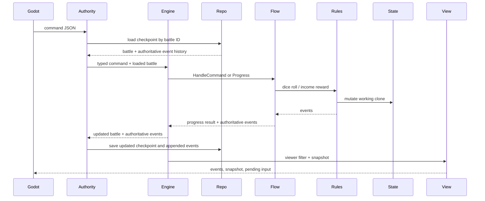

# Current Battle Implementation Gap Analysis

## Purpose

Compare the current Dice and Destiny V2 Go implementation with:

- `docs/v2-planning/godot_pve/07_authoritative_battle_rules_model.md`
- `docs/godot_pve_player_combat_flow/3_segment_flow_completion_policy.md`

This review reflects the live working tree on June 14, 2026, including the current uncommitted Story 3 and Phase 1 lifecycle changes.

## Executive Answers

### 1. Is the core battle-engine loop set up?

**Partially, with a good orchestration foundation.**

The current engine correctly establishes:

- deterministic segment order
- round advancement
- one authoritative progression loop
- exact-once segment entry
- `OnEnter`, `Progress`, and `OnExit`
- persisted segment, stage, and iteration
- per-actor progress states
- human pending input
- automatic AI progression
- event accumulation across automatic segments
- command checkpoint validation
- viewer-safe event and snapshot filtering
- rollback-by-clone around flow operations
- an automatic progression guard

It does not yet establish:

- reusable nested resolutions
- generic interaction/reaction windows
- reveal/reaction/revalidation cycles
- complete offensive planning
- defensive planning
- damage resolution
- statuses or trigger hooks
- battle completion
- disk-backed battle storage or process-restart recovery

The current code is a repository-backed flow-control skeleton, not yet the complete gameplay engine.

### 2. Can a new battle accept the player and enemies?

**Yes at the lifecycle boundary, with participant loading still injected.**

`start_battle` now accepts:

```text
one player descriptor
+ one or more enemy descriptors
```

Each descriptor preserves:

- stable actor instance ID
- reusable definition ID
- controller type derived from player or enemy participation

The authority delegates authoritative state construction to an injected `ParticipantAssembler`. Tests prove one player and two enemies can start, progress to the first human wait, persist, and accept a later command against the same battle.

The production assembler is still missing:

- character-sheet setup creates only one actor
- run-player setup creates only one actor
- no enemy definition loader exists
- mutable player state still contains only card zones
- the default exported authority rejects `start_battle` until an assembler is configured

### 3. Is there a reusable reaction-window system?

**No.**

The code has `PendingInput`, actor readiness, hidden offensive commitments, and flow stages. These are useful prerequisites.

There is no persisted structure for:

- a proposed resolution batch
- eligible reactors
- hidden reaction commitments
- reveal rounds
- reaction chains
- suspended segment checkpoints
- simultaneous conflict resolution
- returning to an originating flow after reactions

Reaction behavior remains design-only.

## Current System Route

The public route is now:

```text
start_battle JSON
-> validate participant descriptors
-> ParticipantAssembler
-> create and progress battle
-> repository.Create(checkpoint + authoritative events)
-> viewer-filtered events + snapshot

later command JSON
-> repository.Load(battle ID)
-> Engine.ApplyBattleCommand
-> append authoritative events
-> repository.Save(updated checkpoint)
-> viewer-filtered events + snapshot
```

The default repository is in-memory. It preserves battles across calls within the authority process but does not survive process restart.

## Current Sequence



This route now exists. Production player/enemy assembly and disk-backed recovery remain.

## What Is Already Aligned

### Segment Package

Status: **Aligned**

The segment package only knows:

- segment IDs
- order
- current round
- next segment
- round wrap

It does not import gameplay packages.

### Engine Progression Contract

Status: **Strong foundation**

`Engine.ProgressUntilInput` is the single authority for:

- entry
- automatic progression
- waiting
- segment completion
- exit
- advancement
- accumulated events

`OnExit` runs only after `ProgressSegmentComplete`.

The engine clones state before entry, progress, exit, and command handling. Failed operations do not commit partial state.

### Actor Synchronization Primitives

Status: **Foundation present**

The state includes:

```text
resolving_automatic
needs_input
locked_in
resolved
not_participating
```

Pending input records:

- actor
- segment
- stage
- iteration
- source
- allowed commands

The engine validates that only human-controlled actors cause normal waits.

### Hidden Planning Data

Status: **Partial**

`OffensiveCommitment` can store:

- final dice
- rolls used
- selected ability
- selected cards
- selected targets
- private roll history

Events and snapshots hide another actor's offensive dice during planning.

The commitment is never created for a human, revealed, revalidated, or resolved.

### Dice

Status: **Useful reusable mechanic**

The dice package supports:

- authority-generated random rolls
- deterministic test random sources
- dice definitions
- face number
- value
- symbols
- reroll indices
- kept-index validation
- roll counts
- combinations
- symbol counts
- roll source types for segment, ability, card, status, and system

This is a good base for offensive, defensive, Blind, and poison rolls.

### Viewer Filtering

Status: **Early foundation**

The current code:

- shows own hand IDs
- shows opponent hand count only
- hides opposing planning dice
- hides another actor's pending roll request
- filters response events separately from authoritative event creation

The policy is still hard-coded by event type and the literal offensive `"reveal"` stage. A richer visibility policy is required when reaction commitments and partially revealed batches exist.

## Critical Runtime Gaps

### Participant Assembly Is Not Production-Wired

The lifecycle now owns participant descriptors and validates the assembler output against the requested actor set.

The remaining gap is the production `ParticipantAssembler` implementation that must:

- load mutable player run state
- load fresh enemy definitions
- merge dice definitions and actor setup
- preserve the complete actor model described in Phase 2

The exported default authority uses the in-memory repository but intentionally has no placeholder content assembler.

### Terminal Status Is Represented but Not Yet Evaluated

Battle state now supports:

```text
active
victory
defeat
draw
escaped
```

Engine results return:

```text
status = waiting_for_input
```

or:

```text
status = battle_complete
battle_result = victory | defeat | draw | escaped
```

The remaining gap is Phase 9 battle-completion evaluation at the correct segment-exit checkpoint.

### Offensive Cannot Finish for a Human Actor

The only allowed offensive command is `roll_dice`.

After a roll:

- actor progress remains `needs_input`
- pending input remains unchanged
- the roll request remains incomplete
- no `select_ability`, `play_card`, `commit`, or `pass` command exists
- after maximum rolls, another roll is rejected

Therefore, a real human offensive segment cannot currently reach `locked_in` or complete.

### AI Planning Is Only a Placeholder

The default AI creates an empty commitment without:

- rolling dice
- selecting an ability
- selecting targets
- playing cards
- validating costs
- passing explicitly

It proves that AI can lock in without blocking the human, but it is not enemy gameplay.

### Defensive Is Automatic and Empty

Defensive currently:

- marks every actor as automatically resolving
- immediately marks every actor resolved
- completes

It does not inspect incoming attacks or support defensive dice, cards, abilities, commitments, reveal, reactions, or revalidation.

Its `roll_dice` handler is unreachable in normal default flow because no defensive roll request or pending input is created.

### Ongoing Effects and Damage Resolution Are Placeholders

Both flows immediately resolve every actor and complete.

There is no implementation of:

- poison
- advanced poison
- Baryl
- trigger ordering
- status stacks
- effect application
- damage proposals
- card selection
- prevention
- permanent card removal
- immediate consequences
- segment-end battle evaluation

## Battle Setup Gaps

### Character Content Loads More Than Battle Setup Preserves

The character YAML loader reads:

- character metadata
- resource configuration
- health model
- decklist
- dice loadout
- ability IDs

`BattleSetupFromCharacterCombatSheet` currently preserves only:

- actor ID
- expanded deck
- dice loadout
- dice definitions

It drops:

- character ID, name, and class
- starting and maximum hand size
- starting and maximum energy
- max health metadata
- ability IDs
- statuses and tokens
- controller type

`ActorState` has no fields for most of that information.

### Mutable Run State Is Too Narrow

The run save and run-player setup contain only:

- actor ID
- deck
- hand
- discard
- removed cards

They do not preserve:

- dice loadout
- abilities
- resources
- character metadata
- persistent statuses/injuries
- automation preferences

The loader is JSON-only despite the desired mutable YAML direction. File format is less important than preserving the complete mutable run state, but the desired format should be settled before save migration work grows.

### Empty Deck Validation Conflicts With Card-as-Health State

The run loader and setup reject an empty draw deck.

A living actor can legitimately have:

```text
draw = empty
discard = non-empty
hand = non-empty
```

Validation should reject zero total health-cards, not an empty draw zone by itself, unless loading a defeated run is intentionally prohibited.

### No Enemy or Encounter Content

The `enemy` package contains only a README.

There is no:

- enemy YAML schema
- enemy loader
- encounter request
- instance-ID assignment
- controller configuration
- multi-actor setup assembler

## YAML and Effect-System Gaps

The current content schema defines:

```go
type ContentEffect struct {
    Type string
}
```

All sample effects are `noop`.

The schema cannot yet express:

- effect parameters
- targets
- amounts
- status stack limits
- trigger segment and phase
- priority
- dice definitions per effect
- outcome ranges
- nested effects
- visibility or reaction policy
- stack overflow behavior

No effect registry/interpreter maps YAML operations to Go mechanics.

The next effect-system design should support typed parameters rather than a generic unvalidated map where practical.

## Reaction and Resolution Gaps

Missing authoritative state:

- resolution batch
- proposal IDs
- proposal source and target
- accumulated and per-source damage
- selected-but-not-removed damage cards
- active interaction window
- eligible actors
- hidden reaction commitments
- reveal status
- reaction round
- chain depth
- suspended flow checkpoint
- conflict results

Missing commands:

- play card
- select ability
- select target
- commit actions
- pass
- choose card
- manipulate die

Missing rule services:

- proposal generation
- batch reveal
- reaction eligibility
- collision classification
- reaction resolution
- batch commit
- immediate-consequence scheduling
- targeted revalidation

## Damage and Battle-End Gaps

There is no damage package or card-as-health removal mechanic.

The existing card package only draws and reshuffles.

Missing:

- uniform random selection across draw plus discard
- hand fallback
- proposed damage cards
- viewer-visible damage reveal
- damage prevention/replacement
- permanent removal
- healing from removed
- defeat detection
- simultaneous outcome evaluation
- victory, defeat, draw, and escaped results
- segment-exit battle completion gate

## Events, Replay, and Persistence Gaps

### Events

Only these events currently exist:

```text
segment_advanced
segment_entered
cards_drawn
discard_reshuffled
energy_points_gained
roll_requested
dice_rolled
```

There is no event envelope containing:

- event ID or sequence
- battle ID
- schema version
- visibility/reveal metadata
- causal source
- command ID
- resolution/window ID
- timestamp or deterministic ordering metadata

### Event History

Repository checkpoints now retain the authoritative events emitted at battle start and by each accepted command. Viewer filtering happens only when the response is built, so stored events do not lose private authoritative data.

The history still lacks:

- event IDs or sequence numbers
- schema/content version pinning
- command and causal metadata
- replay validation
- disk durability

### Battle Save

There is now a battle repository interface and an in-memory implementation with defensive checkpoint copies.

Still missing:

- battle-state serializer
- save writer
- checkpoint version
- disk-level atomic save behavior
- durable event-log persistence
- process-restart resume test

## Recommended Implementation Order

The next work should build vertical foundations in this order.

### Phase 1: Durable Battle Lifecycle - Implemented June 14, 2026

Implemented:

- `start_battle` request
- participant descriptors with instance and definition IDs
- battle repository interface
- in-memory repository implementation for tests/local runtime
- load-by-battle-ID command handling
- save-after-accepted-command/checkpoint behavior
- terminal battle status in engine results

Focused tests prove:

1. A JSON caller starts one player and two enemy instances.
2. The injected assembler receives all requested descriptors.
3. The engine advances to the first human wait.
4. The checkpoint and authoritative events are stored.
5. A later JSON roll command loads the same battle.
6. The command mutates the existing roll state.
7. The updated state and new authoritative event are saved.
8. Duplicate battle IDs do not replace an existing checkpoint.
9. Repository create/load/save boundaries do not alias mutable state.

Remaining Phase 1 infrastructure limitation:

- the in-memory repository is durable only across calls in the current process; process-restart durability remains Phase 9

### Phase 2: Complete Battle Setup

Expand actor setup/state to preserve:

- metadata
- controller
- full card zones and decklist
- resources
- dice
- abilities
- statuses and tokens
- roll preferences

Add:

- enemy definition YAML
- enemy loader
- encounter assembler
- one player plus multiple enemies
- fresh enemy instances per battle
- mutable player run-state merge

### Phase 3: Generic Nested Resolution and Window State

Before implementing poison or full offensive behavior, add persisted generic concepts:

- resolution checkpoint
- proposal batch
- interaction window
- eligible actor states
- hidden commitments
- reveal round
- reaction chain
- source checkpoint resume
- chain and automatic-step guards

Prove the mechanism with fake/test rules first.

### Phase 4: Shared Planning Flow

Create reusable synchronized planning machinery for offensive and defensive:

- roll/reroll
- play cards
- select ability
- select targets
- pass
- lock in
- reveal final face numbers and symbols
- reaction chain
- revalidation
- reopen materially affected actors

Offensive and defensive should configure this machinery rather than duplicate it.

### Phase 5: Typed Content Operations

Expand YAML and add an operation registry for:

- damage
- status application/removal
- dice rolls and manipulation
- card movement
- resources
- targeting

Add trigger definitions using only:

```text
segment
phase: on_enter | in_progress | on_exit
priority
```

### Phase 6: Damage and Card-as-Health

Implement:

- damage proposals
- source attribution and accumulated totals
- uniform draw/discard card selection
- hand fallback
- reveal-before-removal
- damage reactions
- permanent removal
- healing primitives

### Phase 7: First Real Status Slice

Implement poison end to end:

- parameterized YAML
- one roll per stack
- simultaneous rolls
- dice reaction window
- accumulated damage
- damage-card reaction window
- status removal outcome

Then implement advanced poison from YAML without new poison-specific orchestration code.

Use Baryl afterward to prove immediate nested consequences and custom stack overflow.

### Phase 8: Blind and Segment-End Resolution

Implement Blind at offensive `on_exit`:

- only actors with selected abilities roll
- all Blind rolls occur simultaneously
- reaction chain
- cancel complete offensive proposal on failure
- expire Blind

### Phase 9: Battle Completion, Replay, and Recovery

Add:

- segment-exit completion evaluation
- victory, defeat, draw, and escaped
- authoritative event sequence
- durable battle checkpoint
- replay reader
- process-restart resume tests
- content-version pinning strategy

## Immediate Next Story Recommendation

Do not implement poison next.

The highest-value next story is Phase 2:

> Implement the production participant assembler and complete actor setup.

Minimum proof:

1. The player descriptor loads mutable run state.
2. Enemy descriptors load fresh enemy YAML definitions.
3. One player and multiple enemies merge into one `BattleSetup`.
4. Actor state preserves metadata, resources, complete card zones, dice, abilities, statuses/tokens, and roll preferences.
5. The default exported authority can execute `start_battle` without a test assembler.

## Verification

Current test result:

```text
go test ./...
PASS
```

The passing suite now proves the in-process battle lifecycle as well as the existing engine skeleton contracts. It does not prove production participant loading, process-restart recovery, reactions, damage, statuses, battle-result evaluation, or replay.
