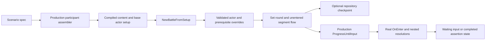
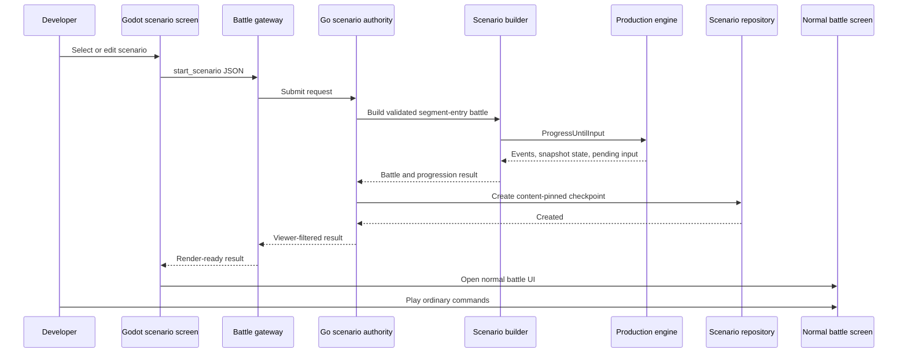

# Mid-Battle Scenario Harness And Player Launch Research

## Purpose

This document researches how to start a battle from a deliberately constructed
mid-battle state for both focused engine tests and interactive player testing
through Godot.

The target use case is not crash recovery. Phase 9 already restores an exact
persisted checkpoint after a process restart. The target use case here is a
synthetic scenario such as:

```text
round 2
ongoing_effects/on_enter
player has 2 Poison stacks
player has already lost 4 health cards
enemy remains active
```

The test or player session should begin at that boundary and execute the
production ongoing effects implementation without playing round 1.

## Conclusion

The current architecture can support this cleanly, but it does not yet expose
a reusable scenario-construction API or a developer-facing scenario launch
path.

The recommended implementation is a separate, versioned scenario test harness
with two fixture levels:

1. **Segment-entry scenarios** are the default. They specify participants,
   actor state, round, target segment, and any completed prior-segment outputs.
   The target segment remains unentered. The production engine then runs its
   real `OnEnter`, creates resolutions and pending input, and automatically
   progresses until human input.
2. **Exact-checkpoint fixtures** are an advanced escape hatch. They contain the
   complete authoritative battle checkpoint and are used only when a test must
   begin inside an already-open planning, roll, reaction, or damage-resolution
   window.

Both fixture levels should feed one shared, validated scenario-construction
core. Automated tests call it directly. A development-only scenario launcher
uses it to create a normal durable checkpoint, then returns the same
viewer-safe snapshot and pending input as an ordinary battle.

Do not add arbitrary state fields to the production `start_battle` command. A
scenario is synthetic authority input, not a normal player command, and
accepting arbitrary authoritative internals through `start_battle` would
weaken production validation and hidden-information boundaries. Interactive
player testing should use a separate, explicitly gated `start_scenario`
authority path.

## Completeness Of This Research

With the player-launch additions below, this document covers the known
architecture and implementation work required to make mid-battle scenarios
usable by:

- Go unit and integration tests
- authority/repository restart tests
- Godot headless scenarios
- a developer selecting a scenario and playing it in the normal battle UI
- a developer resuming that synthetic battle after a process or client crash

It does not define the visual design of the final battle screen or scenario
editor. The current Godot project contains an authority spike and reserved
package structure, not a production battle screen. Therefore, interactive
player testing also depends on implementing the normal battle gateway, view
state, and battle presentation that every real battle requires.

The state model will continue to grow. When future mechanics add persisted
cooldowns, durations, scheduled operations, once-per-round markers, or similar
state, the scenario schema and validator must be extended deliberately. A
versioned scenario schema makes those additions explicit instead of silently
accepting incomplete fixtures.

## Existing Capabilities

### Exact Crash Recovery Already Works

The Phase 9 checkpoint contains:

- complete `state.Battle`
- pending input
- active nested resolution and interaction windows
- hidden commitments
- roll requests and actual rolled results
- planning and damage-resolution state
- actor card zones, statuses, resources, and defeat state
- compiled authoritative content
- content fingerprint
- authoritative event history and next sequence

For every command after `start_battle`, `Authority` loads that checkpoint,
applies the command, and saves the new checkpoint. Recovery tests reconstruct
both the disk repository and `Authority`, then continue from planning and
reaction input without reloading live content.

This means a crash can resume the exact persisted battle. It does not mean a
caller can currently describe and create an arbitrary synthetic battle.

### Tests Already Construct Coarse Mid-Battle States

Several tests use the correct low-level pattern:

```go
battle.Segment = segment.State{
    Current: segment.Offensive,
    Round:   1,
}
battle.Flow = state.NewSegmentFlowState(battle.Segment)

result, err := engine.ProgressUntilInput(&battle)
```

Planning tests use this to enter offensive or defensive planning. Damage tests
also provide finalized offensive proposals before entering
`damage_resolution`.

This proves that the engine already supports starting at a segment boundary.
What is missing is a reusable builder, complete validation, deterministic
dependencies, and a concise fixture format.

### Current Gap Map

| Capability | Current state | Required work |
| --- | --- | --- |
| Exact authority crash recovery | Implemented by Phase 9 | Keep and reuse |
| Manual round/segment setup in Go tests | Repeated ad hoc test code | Shared scenario builder |
| Validated actor mid-state overrides | Not centralized | Scenario schema and validator |
| Deterministic status/planning rolls | Not engine-wide | Per-battle random policy |
| Durable synthetic battle creation | Possible through low-level repository calls | Scenario authority orchestration |
| Player launch from Godot | Not implemented | Scenario screen and request path |
| Client reopen after crash | No read-only authority request | `open_battle` |
| Synthetic/normal save separation | Not represented | Provenance and repository routing |
| Prevent synthetic rewards/progression | No run completion integration yet | Explicit origin guard before integration |
| Godot production battle UI | Reserved folders and spike only | Normal gateway/view-state/screen implementation |

## Why Round And Segment Are Not Always Enough

At an unentered segment boundary, round and segment are sufficient to identify
where production progression should begin.

Inside a segment, the authoritative location also includes:

- flow stage and iteration
- whether `OnEnter` has completed
- active resolution ID
- resolution origin phase and suspended checkpoint
- active interaction window
- reaction round and chain depth
- actor progress
- pending input IDs and allowed commands
- hidden commitments and reveal state
- roll requests and current roll state
- planning cycle and revisions
- damage-resolution stage and proposals

Therefore, "round 4 offensive" should normally mean:

```text
round 4, immediately before offensive OnEnter
```

If a test means "round 4 offensive, player has rolled once and the enemy is
secretly locked in while the player is choosing cards," that is an exact
checkpoint fixture, not a segment-entry scenario.

## Recommended Architecture

Add a package such as:

```text
dice-and-destiny-server/internal/battle/scenario/
```

The package should depend on lower-level participant assembly contracts, the
state model, engine, repository checkpoint, and segment packages. Production
engine code must not depend on the scenario package.

The current `Participant`, `ParticipantAssembler`, and
`FileParticipantAssembler` types live in the top-level `battle` package. If
`battle.Authority` imports `battle/scenario` while `battle/scenario` imports
`battle` for those types, Go will reject the import cycle.

Resolve this before adding the builder:

```text
internal/battle/participant/
    participant.go
    file_assembler.go
```

Move or extract the participant descriptor and assembler interface into that
lower-level package. Both normal authority and scenario construction can then
depend on it without either depending on the other. The file assembler may
remain physically near its current code if an adapter implements the
lower-level interface, but the shared types cannot remain owned only by the
top-level authority package.



The same core supports interactive launch:



### Shared Core, Separate Entry Points

The scenario builder should not know whether its caller is a test or Godot.
Its job is to turn a typed scenario specification into a valid authoritative
battle.

Use separate callers:

- tests call `scenario.Builder` directly
- `ScenarioAuthority` validates developer access, loads a named or inline
  scenario, creates the durable checkpoint, and returns a normal result
- ordinary `Authority` continues an existing scenario battle using the same
  command application code as any other battle

The C++ GDExtension bridge does not need gameplay-specific changes. It already
transports arbitrary command JSON through `submit_command`. The new behavior
belongs in Go and Godot's command/gateway layers, not in C++.

## Interactive Player Launch

### Developer Authority Requests

The first interactive version should support:

```text
list_scenarios
validate_scenario
start_scenario
open_battle
```

`list_scenarios` returns safe metadata for named scenario fixtures.

`validate_scenario` validates a named or inline declarative specification
without creating a battle. This supports a future Godot scenario editor.

`start_scenario` builds the synthetic battle, progresses to the first human
input or terminal state, writes a durable checkpoint, and returns the normal
engine result shape.

`open_battle` is a read-only resume operation. It loads an existing checkpoint
and returns the current viewer-safe snapshot and pending input without
advancing the engine, rerolling, appending events, or mutating the checkpoint.
This is required for a client restart: knowing only the battle ID is not enough
for Godot to reconstruct the current screen safely.

These can use the existing JSON transport, but they should be distinguished
from ordinary gameplay commands in Go ownership and validation. If they remain
in the command envelope, use explicit types such as `start_scenario`; do not
overload `start_battle`.

### Named And Inline Scenarios

Support two authoring paths over time:

1. **Named fixtures** are version-controlled YAML files under a configured
   scenario root. Godot sends a safe scenario ID, not a filesystem path.
2. **Inline specifications** are produced by a developer scenario editor and
   use the same versioned schema and validator.

Named fixtures should be implemented first. They are easier to review,
reproduce, share, and run in automated tests.

The authority must validate scenario IDs with the same path-safety discipline
as battle IDs. Never accept an arbitrary local path from Godot.

### Participant Baselines

The current normal participant assembler loads a human from a run-player save
and an enemy from an enemy definition. Interactive and automated scenarios
need an explicit baseline choice:

- `run_player` starts from a selected run-player save, then applies scenario
  overrides
- `character_definition` starts from stable authored character combat content,
  then applies scenario overrides
- `enemy_definition` starts from stable authored enemy content, then applies
  scenario overrides

Stable regression fixtures should normally use authored fixture definitions,
not the mutable current run save. Player-feel testing may deliberately choose
the current run player.

The scenario participant descriptor therefore needs a source kind in addition
to instance ID and definition ID. The assembler must reject source/controller
combinations that do not make sense. Existing
`BattleSetupFromCharacterCombatSheet`, run-player setup, and enemy setup should
be reused rather than duplicating participant construction.

### Godot Responsibilities

The Godot side needs:

- a development-only scenario selection screen
- optional controls for actor overrides, round, segment, and random mode
- command builders for scenario authority requests
- a battle gateway that submits JSON and parses results
- persistent local knowledge of the active battle ID
- an `open_battle` call during startup or battle-screen re-entry
- view-state initialization from the returned snapshot
- routing from scenario launch into the same battle screen used by normal play
- visible labeling that the battle is synthetic
- clear validation errors without attempting client-side rule enforcement

The battle screen must initialize from the snapshot, not by replaying imagined
rounds 1 through N-1. Events returned by `start_scenario` describe only work
that occurred after the synthetic entry point.

### Go Authority Responsibilities

The Go side needs:

- scenario feature gating
- a scenario catalog/loader
- the shared builder and validator
- scenario creation orchestration
- durable checkpoint creation
- viewer-safe result generation
- read-only checkpoint opening
- scenario provenance and save routing
- explicit errors for disabled tooling, invalid specs, duplicates, corrupt
  saves, and unsupported schema versions

Once created, the scenario battle must use the existing `ApplyBattleCommand`,
event sequencing, repository save, completion, snapshot filtering, and replay
paths without special gameplay branches.

### Suggested Core API

Use typed Go builders first. A JSON or YAML loader can wrap the same typed
model later for data-driven fixtures and developer tooling.

```go
type EntryPoint struct {
    Round   int
    Segment segment.Segment
}

type Metadata struct {
    ID          string
    Name        string
    Description string
}

type RandomPolicy struct {
    Mode string // normal or reproducible
    Seed uint64
}

type ParticipantSpec struct {
    InstanceID   string
    DefinitionID string
    Controller   state.ControllerType
    Source       participant.SourceKind
}

type Spec struct {
    SchemaVersion int
    BattleID      string
    Metadata      Metadata
    Player        ParticipantSpec
    Enemies       []ParticipantSpec
    Entry         EntryPoint
    Actors        map[string]ActorOverride
    Prerequisites SegmentPrerequisites
    Random        RandomPolicy
}

type ActorOverride struct {
    CardZones   *state.CardZones
    Energy      *int
    Statuses    *[]state.StatusState
    Tokens      *[]state.TokenState
    DefeatState *state.ActorDefeatState
}

type Builder struct {
    Assembler participant.Assembler
}

func (b Builder) Build(spec Spec) (state.Battle, error)
func (b Builder) BuildAndProgress(
    spec Spec,
    engine engine.Engine,
) (state.Battle, engine.ProgressionResult, error)
func (b Builder) BuildCheckpoint(spec Spec) (repository.Checkpoint, error)
```

The exact names can change, but the responsibility split should remain:

- assembler loads normal compiled content and base participant definitions
- scenario builder applies deliberate state overrides
- validator rejects impossible or internally inconsistent scenarios
- engine creates segment-specific flow state and nested resolutions
- repository creates the same versioned, content-pinned checkpoint used in
  production

### Explicit Override Semantics

Avoid ambiguous partial patches. The builder should expose clearly named
operations such as:

- `SetCardZones`
- `SetEnergy`
- `SetStatuses`
- `AddStatus`
- `SetTokens`
- `SetDefeatState`

For card-as-health, "damage dealt" is represented by moving cards into
`Removed`. A scenario must provide all card zones together so card occurrence
conservation can be validated against the decklist.

## Segment-Entry Construction

The builder should:

1. Validate the scenario schema and requested participants.
2. Run the production participant assembler.
3. Call `state.NewBattleFromSetup`.
4. Apply actor overrides.
5. Apply only allowed prior-segment outputs.
6. Set `Battle.Segment` to the requested round and segment.
7. Set `Battle.Flow = state.NewSegmentFlowState(Battle.Segment)`.
8. Require no active resolution, pending input, current segment flow internals,
   or uncommitted hidden choices.
9. Optionally call `repository.NewCheckpoint`.
10. Call production `Engine.ProgressUntilInput` when the test requests
    automatic progression.

Leaving `Flow.Entered == false` is essential. It makes production `OnEnter`
responsible for:

- stage and iteration values
- deterministic resolution IDs
- roll requests
- actor participation
- interaction windows
- pending input IDs
- suspended checkpoints

Tests then validate the real setup logic instead of duplicating it in fixtures.

## Segment Prerequisites

Some segments depend on finalized output from earlier segments.

| Target segment | Required synthetic prerequisites |
| --- | --- |
| `ongoing_effects` | Actor state only |
| `income` | Actor state only |
| `offensive` | Actor state only |
| `defensive` | Finalized offensive proposals when testing an incoming attack |
| `damage_resolution` | Finalized offensive and optional defensive proposals |

Prerequisites should use domain-level finalized proposals, not flow internals.
The harness should provide helpers that construct valid proposals from
content/actor IDs and validate their references.

## Poison Example

A concise future fixture could look like:

```yaml
schema_version: 1
battle_id: poison-round-2

player:
  instance_id: player
  definition_id: current_run_player

enemies:
  - instance_id: goblin-1
    definition_id: mock_goblin

entry:
  round: 2
  segment: ongoing_effects

actors:
  player:
    statuses:
      - instance_id: player-poison-1
        definition_id: poison
        stacks: 2
    card_zones:
      deck: [Card A, Card B, Card C]
      hand: [Card D]
      discard: [Card E]
      removed: [Card F, Card G, Card H, Card I]
```

The harness should not create a Poison resolution. Phase 7's production
`OngoingEffectsFlow.OnEnter` should:

1. find the compiled Poison trigger on the player
2. create one roll per stack
3. group compatible status rolls
4. record actual dice results
5. open the normal reaction chain
6. evaluate outcomes
7. create accumulated damage
8. run damage-card reaction and commitment

This test starts at exactly the useful boundary while still testing all new
Phase 7 orchestration.

## Exact-Checkpoint Fixtures

Some tests need to begin inside a pending input:

- the second planning cycle
- a reaction window after hidden enemy commitment
- the damage-card reaction stage
- a nested immediate status consequence

Those tests require a complete `repository.Checkpoint`, because the pending
input is meaningful only with its matching resolution, window, stage,
iteration, commitments, content pin, and event sequence.

Recommended rules:

- reuse `repository.Checkpoint` and `repository.ValidateCheckpoint`
- generate IDs and windows through production helpers whenever possible
- prefer capturing a known-good checkpoint after a short setup path over
  hand-authoring all resolution internals
- store exact fixtures only when their precision is worth their maintenance
  cost
- treat fixture schema/version failures as explicit errors

An exact checkpoint fixture is also appropriate for recovery tests. It should
not replace segment-entry scenarios for ordinary mechanic tests.

### Interactive Starts Inside A Window

For player testing inside an already-open planning or reaction window, prefer
a **setup script** over hand-authored resolution internals:

```text
validated segment-entry scenario
-> deterministic production progression
-> scripted authoritative commands
-> assert expected checkpoint
-> persist
-> hand control to the player
```

For example, a fixture can enter round 4 offensive, script the first roll and
card selection through normal commands, stop when the planning reaction window
opens, and then launch the battle screen for the developer.

This has several advantages:

- production code generates all IDs, windows, commitments, and pending input
- hidden data remains authoritative
- the fixture fails when the real flow no longer reaches the expected state
- the resulting checkpoint is valid by construction
- the same setup can be used by automated tests and interactive play

Setup scripts need strict limits, expected-state assertions, and deterministic
randomness when outcomes affect the path. They must run inside the scenario
authority before the checkpoint is exposed to Godot.

Raw exact-checkpoint fixtures remain useful for recovery and corruption tests.
Do not make arbitrary raw checkpoint JSON the primary player-launch format.

## Required Validation

The current engine validates flow/resolution consistency, but it does not
provide one comprehensive public validator for arbitrary actor state. The
scenario package needs validation before progression or persistence.

### Battle And Entry Validation

- valid battle ID
- supported scenario schema version
- exactly one human player and at least one enemy for production-like tests
- unique actor instance IDs
- round is at least 1
- segment is valid
- battle status is active
- segment-entry mode has a new unentered flow
- no active resolution or pending input in segment-entry mode

### Actor Validation

- referenced card, ability, status, and dice definitions exist
- card occurrences across all zones exactly match the decklist
- `Health.MaxHealth` matches the card-as-health deck size
- current health equals deck + hand + discard
- energy is non-negative and does not exceed maximum
- status instance IDs are unique
- status definitions exist
- status stacks are positive and do not exceed the compiled stack limit
- token IDs are valid and unique where required
- defeat state is valid and consistent with remaining health
- controller and definition metadata remain consistent with the participant

### Segment Prerequisite Validation

- proposal IDs are unique
- proposal actors and targets exist
- proposal segment matches its origin
- referenced content exists and is allowed in that segment
- selected targets and finalized operations agree
- defensive proposals reference defensible offensive proposals
- damage-entry proposals are finalized, not hidden planning commitments

The builder must fail fast with field-specific errors rather than allowing a
malformed scenario to fail later in unrelated engine code.

## Deterministic Randomness

Focused scenario tests need deterministic outcomes.

Damage-card selection already supports an injected random source. Dice rolling
also supports `dice.WithRandomSource`, but planning currently invokes
`dice.Roll` without an engine-level injected source.

Before the harness can reliably script Phase 7 status rolls, engine random
dependencies should be centralized in `engine.Config`, for example:

```go
type Config struct {
    DiceRandom   dice.RandomSource
    DamageRandom damage.RandomSource
    // existing limits, proposal rules, and interaction AI
}
```

All production flows should use those dependencies. Production defaults remain
cryptographic randomness; tests use `dice.NewSequenceRandomSource`.

Interactive scenarios need two modes:

- **normal randomness** uses the production random behavior and is the default
  for ordinary player-feel testing
- **reproducible randomness** uses a scenario seed or scripted stream so a bug
  can be replayed from the same initial scenario

For reproducible sessions, a random source stored only on the process-wide
`Engine` is insufficient. A restart would lose its position. Persist
per-battle random metadata such as algorithm, seed, and draw cursor in the
authoritative checkpoint, or use a counter-based generator derived from
battle ID and persisted cursor. Every accepted random action must advance that
state in the same atomic checkpoint save as its recorded result.

Do not use one mutable seeded random source shared across battles. Concurrent
battles would affect each other's outcomes and break reproducibility.

Do not put desired dice faces directly into a segment-entry battle. That would
bypass the roll operation being tested. Recorded rolled faces belong in an
exact checkpoint only when testing resume/replay after the roll already
occurred.

## Persistence And Replay

A synthetic scenario can optionally be converted to a normal Phase 9
checkpoint and stored in an in-memory or temporary disk repository. This is
useful for testing:

- scenario creation followed by authority commands
- restart after the scenario reaches planning or reaction input
- content pin stability
- event sequence continuity

The scenario's event history should normally begin empty. It did not actually
play rounds 1 through N-1, so the harness must not fabricate historical events.
Replay will show authoritative events produced after the synthetic entry point,
not a fictional full battle history.

If scenario checkpoints are ever exposed outside tests, add explicit
provenance such as `origin: test_scenario` and use a separate repository root.
Do not mix synthetic battles with normal player save data.

For interactive player testing, checkpoint creation is not optional. A
successful `start_scenario` must persist before reporting success. After that,
the battle receives the same save-after-command behavior as a normal battle
and can recover after a crash.

The checkpoint should include versioned provenance metadata:

```go
type BattleOrigin struct {
    Kind                string // normal or scenario
    ScenarioID          string
    ScenarioSchema      int
    ScenarioFingerprint string
    CreatedBy           string // local_developer initially
}
```

The exact shape may differ, but it must be authoritative and persisted. Adding
this metadata to the Phase 9 checkpoint format requires an intentional
checkpoint schema decision. Because Phase 9 is not yet a deployed compatibility
contract, the cleanest option is to include it before the format is treated as
stable. Once saves ship, format changes require migration or explicit version
rejection.

### Save Isolation And Routing

Scenario battles must not:

- overwrite a normal run-player save
- grant normal rewards, achievements, unlocks, or progression
- be mistaken for a canonical run battle
- collide with normal battle IDs

Use a separate configurable root such as:

```text
DICE_AND_DESTINY_SCENARIO_STATE_ROOT
```

The command authority still needs to find the checkpoint for later gameplay
commands. Recommended options, in order:

1. a repository router that sends a reserved scenario battle-ID namespace to
   the scenario repository
2. a battle registry that records repository ownership
3. one shared repository only if provenance and all progression protections
   are enforced

A reserved generated ID such as `scenario-<fixture>-<unique-suffix>` makes
routing explicit. User-supplied IDs still require validation and duplicate
protection.

On completion, scenario battles should remain replayable and reloadable but
must bypass run rewards and persistence until an explicit future feature says
otherwise.

### Crash And Client Restart

There are two recovery paths:

1. **Authority process restart:** Phase 9 reloads the full checkpoint before
   applying the next command.
2. **Godot/client restart:** Godot reloads its stored active battle ID and calls
   `open_battle` to receive the current viewer-safe snapshot and pending input.

`open_battle` must not call `ProgressUntilInput`. The persisted checkpoint
already represents the last accepted authoritative wait or terminal state.
Advancing during open could create events or random results merely because the
UI restarted.

### Scenario Launch Transaction

`start_scenario` should mirror the proven `start_battle` persistence sequence:

1. load and validate the scenario
2. assemble participants and apply validated overrides
3. run `ProgressUntilInput`
4. create a content-pinned checkpoint
5. assign authoritative sequence numbers to launch events
6. atomically create the checkpoint with duplicate protection
7. return only the assigned viewer-filtered events, snapshot, and pending input

If any step before repository creation fails, no battle should exist. If
repository creation fails, the client must receive a rejection rather than a
successful-looking transient battle.

`open_battle` should use a dedicated read-only result helper. It should derive
`waiting_for_input` or `battle_complete` from the persisted state and return no
new events.

## Content Pinning

The scenario builder should load compiled content through the normal assembler,
embed it in `Battle.Content`, and call `repository.NewCheckpoint`. This gives
the synthetic battle the same deterministic content fingerprint as production.

Scenario actor overrides must not rewrite compiled content. Tests requiring
custom content should point the assembler at a fixture content root. This keeps
the battle self-contained after creation and preserves Phase 9 restart
behavior.

The scenario definition itself should also have a deterministic canonical
fingerprint recorded in provenance. This is separate from the compiled content
pin:

- the content pin answers, "which compiled cards, statuses, abilities, and
  dice does this battle contain?"
- the scenario pin answers, "which synthetic starting specification created
  this battle?"

Canonical scenario hashing must be independent of YAML formatting and map
insertion order. Resume uses the embedded checkpoint and does not require the
fixture file to remain unchanged. The scenario fingerprint is for diagnostics,
reproduction, and changed-fixture detection.

## Production And Security Boundary

Recommended scope:

- shared internal Go scenario package
- typed builder and versioned YAML schema
- direct test APIs
- development-only `ScenarioAuthority`
- development-only Godot scenario screen
- separate durable scenario repository
- ordinary battle commands after scenario creation

Do not add:

- arbitrary JSON deserialization into `state.Battle`
- arbitrary checkpoint import from an untrusted client
- arbitrary filesystem paths supplied by Godot
- scenario launch enabled in normal release builds
- client-only gating without authority enforcement
- synthetic event history for skipped rounds

Scenario tooling should require both:

1. a build that includes developer scenario support
2. an explicit runtime/project setting that enables it

Hiding the Godot button is not sufficient. Go must reject scenario requests
when disabled. A future network server must additionally require authenticated
developer/admin capability and should apply payload-size and request limits.

Exact-checkpoint import is more powerful than a declarative segment-entry
scenario. Keep it test-only initially. If it later becomes a developer tool,
load only trusted local fixture IDs from the configured scenario root and run
full checkpoint validation before creation.

## Testing Strategy

Use four levels:

1. **Operation tests** prove small reusable rules such as Poison face outcome
   evaluation.
2. **Segment-entry scenario tests** prove the full mechanic from the relevant
   production lifecycle boundary.
3. **Exact-checkpoint tests** prove continuation from specific nested waits.
4. **Full battle tests** prove cross-round integration and completion.

Initial harness tests should cover:

- round and segment entry
- damaged player card zones
- statuses and stack limits
- resource and token overrides
- multiple enemies with independent status instance IDs
- malformed card-zone conservation
- unknown content references
- defensive entry with finalized offensive proposals
- damage-resolution entry with finalized proposals
- deterministic dice and damage selection
- persistence and authority continuation after scenario creation
- exact-checkpoint fixture validation
- disabled scenario authority rejection
- named scenario path validation
- run-player and fixed-character participant baselines
- `start_scenario` duplicate protection
- scenario provenance and repository routing
- stable scenario fingerprint and changed-fixture detection
- `open_battle` returning snapshot and pending input without mutation
- process restart after interactive scenario launch
- terminal scenario reload
- normal and reproducible random modes
- reproducible random cursor preservation across restart
- scripted setup to an exact planning or reaction wait
- scenario completion not updating normal run progression
- Godot headless launch through GDExtension
- Godot headless reopen of an existing scenario checkpoint

The first Phase 7 integration test should be the round-two Poison scenario
described above.

Manual player acceptance should prove:

1. launch the round-two Poison fixture from the Godot developer screen
2. see the correct round, segment, health-card damage, statuses, player, and
   enemies
3. interact with the real pending roll/reaction UI
4. close and reopen the game
5. resume from the exact persisted pending input
6. finish the battle through the normal completion UI
7. confirm that normal run progression was not modified

## Proposed Implementation Order

1. Decide the Phase 9 checkpoint provenance and per-battle random-state shape
   before treating checkpoint schema version 1 as stable.
2. Add engine-level random dependencies and per-battle reproducible random
   state.
3. Extract participant descriptors and assembly contracts to a lower-level
   package to avoid an authority/scenario import cycle.
4. Add `internal/battle/scenario` with `Spec`, typed overrides, builder, and
   comprehensive validation.
5. Add segment-specific prerequisite helpers.
6. Add `Build`, `BuildAndProgress`, and `BuildCheckpoint`.
7. Add versioned YAML fixture loading, canonical scenario fingerprinting, and
   a safe named-scenario catalog.
8. Add optional bounded setup scripts for exact production-generated waits.
9. Add focused harness tests using current offensive, defensive, and damage
   flows.
10. Add the gated `ScenarioAuthority`, separate repository root, and repository
   routing.
11. Add `start_scenario`, `validate_scenario`, `list_scenarios`, and read-only
   `open_battle` request handling.
12. Add Godot command builders, battle gateway, scenario screen, and active
    battle-ID persistence.
13. Add Godot headless launch/reopen coverage.
14. Use the harness and player launcher for Phase 7 Poison tests.
15. Add exact-checkpoint fixture utilities only for tests that cannot be
    expressed at a segment boundary.

## Files Likely To Change

Primary additions:

- `internal/battle/participant/participant.go`
- `internal/battle/participant/file_assembler.go` or an adapter from the
  current assembler
- `internal/battle/scenario/spec.go`
- `internal/battle/scenario/builder.go`
- `internal/battle/scenario/validate.go`
- `internal/battle/scenario/prerequisites.go`
- `internal/battle/scenario/loader.go`
- `internal/battle/scenario/catalog.go`
- `internal/battle/scenario/script.go`
- `internal/battle/scenario/fingerprint.go`
- `internal/battle/scenario/scenario_test.go`
- `internal/battle/scenario_authority.go`
- `internal/battle/scenario_authority_test.go`

Likely engine changes:

- `internal/battle/engine/engine.go`
- `internal/battle/engine/planning.go`
- `internal/battle/engine/damage_resolution_flow.go`
- `internal/battle/state/battle.go`
- `internal/battle/repository/repository.go`
- `internal/battle/authority.go`
- `internal/battle/command/command.go`

Fixtures and Godot additions:

- `dice-and-destiny-server/scenarios/*.yaml`
- `dice-and-destiny-client/local_client/battle_gateway/`
- `dice-and-destiny-client/local_client/command_builder/`
- `dice-and-destiny-client/local_client/view_state/`
- `dice-and-destiny-client/app/screens/scenarios/`
- `dice-and-destiny-client/app/screens/battle/`
- `dice-and-destiny-client/tests/scenarios/`

No gameplay-specific C++ bridge change should be required because
`submit_command` already transports JSON to Go.

## Final Recommendation

Implement the shared segment-entry scenario core and gated interactive launcher
before Phase 7. Together they give Poison, Advanced Poison, Baryl, Blind, and
later mechanics a precise automated test entry point and a real player-testing
entry point without weakening normal production authority.

Use exact checkpoint fixtures only for true inside-the-window tests and crash
recovery. A player-launched scenario should become a normal durable battle
immediately after creation, while remaining isolated from normal run
progression and clearly marked as synthetic.
